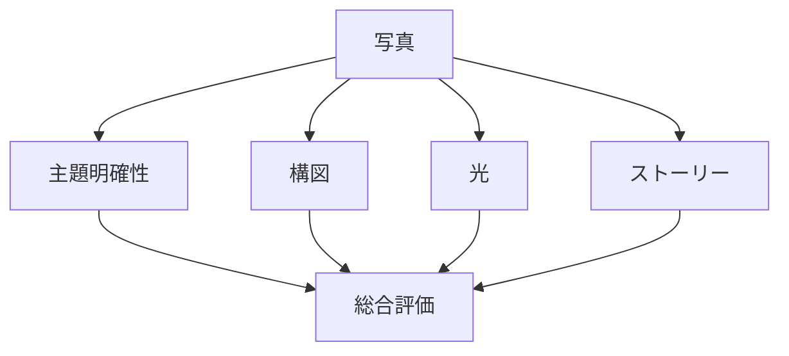

# 写真評価

撮影後は

**写真の評価**

を行う。

---

# 評価構造

```mermaid
graph TD

A[写真]

A --> B[主題明確性]

A --> C[構図]

A --> D[光]

A --> E[ストーリー]

B --> F[総合評価]
C --> F
D --> F
E --> F
```

---

# 評価の問い

- 主題は明確か
- 視線は自然か
- 光は効果的か
- 物語は伝わるか