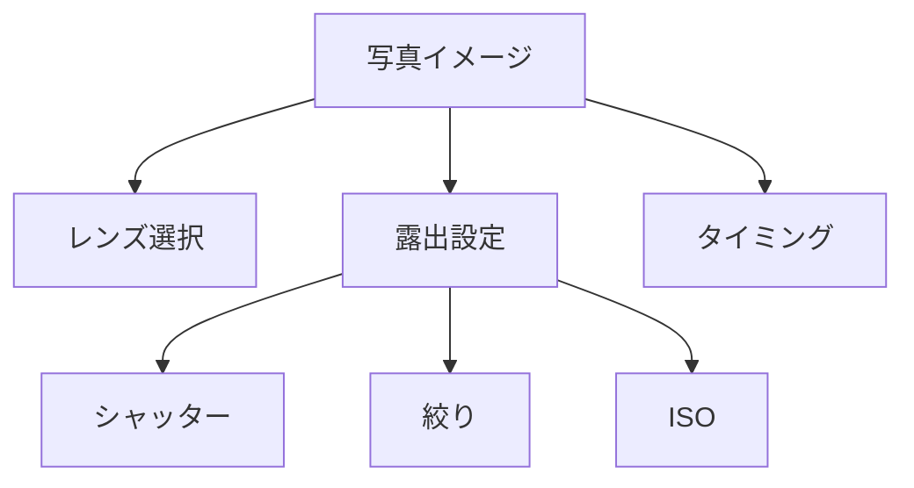

# 撮影意思決定

写真は

**技術的意思決定**

を伴う。

---

# 撮影決定構造

```mermaid
graph TD

A[写真イメージ]

A --> B[レンズ選択]

A --> C[露出設定]

A --> D[タイミング]

C --> E[シャッター]
C --> F[絞り]
C --> G[ISO]
```

---

# 判断基準

## レンズ

広角  
望遠

## シャッター

動きを止める  
流す

## 絞り

背景ボケ  
全体ピント