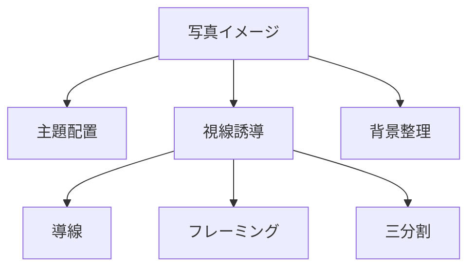

# 構図設計

仮説を

**視覚構造**

に変換する。

---

# 構図設計構造

```mermaid
graph TD

A[写真イメージ]

A --> B[主題配置]

A --> C[視線誘導]

A --> D[背景整理]

C --> E[導線]
C --> F[フレーミング]
C --> G[三分割]
```

---

# 構図設計の問い

- 主題はどこに置くか
- 視線はどこへ流れるか
- 不要な要素は何か