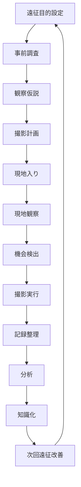
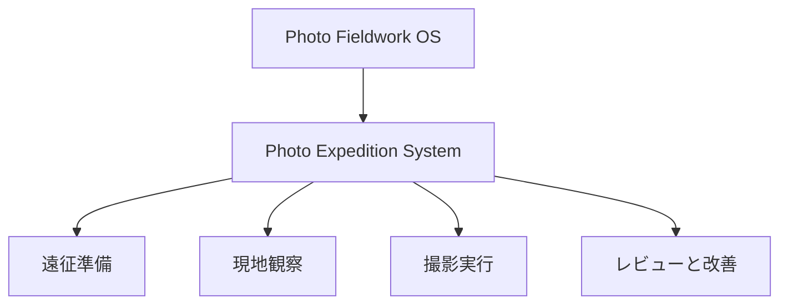

# Photo Expedition System

Photo Expedition System は、

**遠征型撮影**
**調査型フィールドワーク**
**観察駆動の写真実践**

を統合するシステムである。

ここでいう expedition は、単なる旅行ではない。  
それは

**目的を持って現地に入り、観察し、仮説を持ち、記録を回収する行為**

である。

ナショナルジオグラフィック型の撮影では、写真は偶然の産物ではなく、  
**事前設計された探索と現地適応の結果**として得られる。

---

# 目的

- 撮影を「行き当たりばったり」から脱却させる
- 現地での観察密度を上げる
- 文化・地理・人間活動を写真として回収する
- 失敗を次回遠征の知識に変える
- 写真を研究・観光・地域理解に接続する

---

# 全体構造

---

# ノート一覧
## Hub / System
[[Photo Expedition System]]
## Planning
[[遠征目的設定]]
[[事前調査]]
[[観察仮説]]
[[撮影計画]]
[[装備設計]]
## Field Execution
[[現地観察]]
[[機会検出]]
[[撮影実行]]
[[現地適応]]
[[安全管理]]
## Recording
[[フィールドログ]]
[[撮影記録]]
[[位置と時間の記録]]
[[失敗記録]]
## Review
[[遠征レビュー]]
[[写真選別]]
[[観察回収率]]
[[次回改善]]
# 中核思想
遠征型撮影は次の式で動く。

目的 × 調査 × 仮説 × 機動性 × 現地適応 = 良い遠征

写真の質は撮影時だけで決まらない。
むしろ、
- 何を見に行くのか
- 何が起きると予想しているのか
- 現場で何を拾えるか
- 帰ってから何を知識化するか
によって決まる。
# 位置づけ
- [[Photo Fieldwork OS]] は「写真を観察研究として使うOS」
- [[Photo Expedition System]] は「それを現地で運用する実践システム」
- 
つまり

