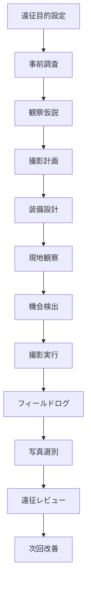

# Photo Expedition Workflow

Photo Expedition System の実行フローをまとめる。

---

# 実行フロー

---

# 運用上の要点
- 計画は細かくしすぎない
- 現地では観察を優先する
- 写真だけでなくログを残す
- レビューまで終えて初めて遠征完了とみなす
# このシステムの本質
Photo Expedition System は、
写真を撮るための旅行管理ではない。
それは、
- 現地に入り、
- 現実を回収し、
- 写真と知識に変換する運用システム
である。