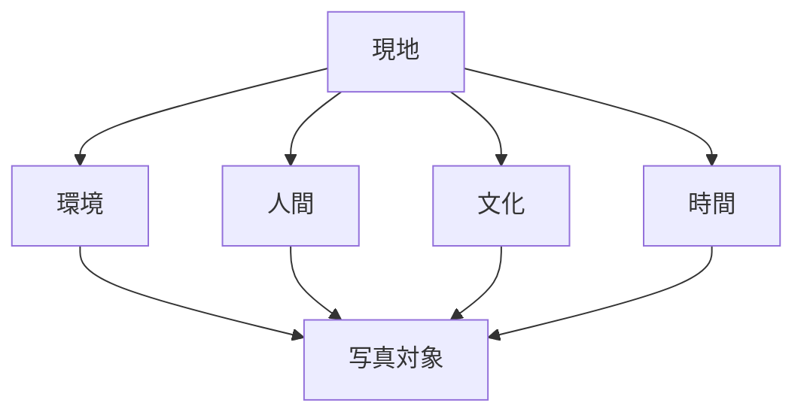

# フィールドワーク観察

フィールドワークとは

**現地で現象を観察する研究方法**

である。

写真は

**観察記録装置**

として使用される。

---

# 観察構造

```mermaid
graph TD

A[現地]

A --> B[環境]
A --> C[人間]
A --> D[文化]
A --> E[時間]

B --> F[写真対象]
C --> F
D --> F
E --> F
```

---

# 観察対象

## 環境

- 地形
- 建築
- 景観

## 人間

- 行動
- 仕事
- 移動

## 文化

- 生活様式
- 伝統
- 社会関係

## 時間

- 日内変化
- 季節