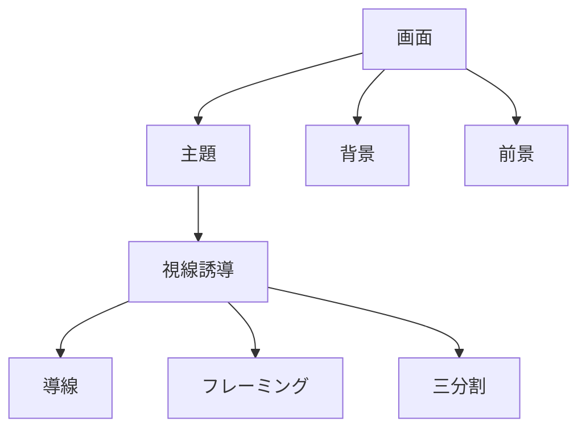

# 構図構造

構図とは

**視線を設計する技術**

である。

---

# 構図構造

---

# 主要構図

## 三分割

被写体を画面の3分割線に置く

## 導線

道・川・線で視線を誘導

## フレーミング

窓・木で被写体を囲む

## 前景

奥行きを作る

# 一覧
- [[三分割構図]]
- [[中央構図]]
- [[対称構図]]
- [[導線構図]]
- [[フレーミング構図]]
- [[前景構図]]
- [[奥行き構図]]
- [[ミニマル構図]]