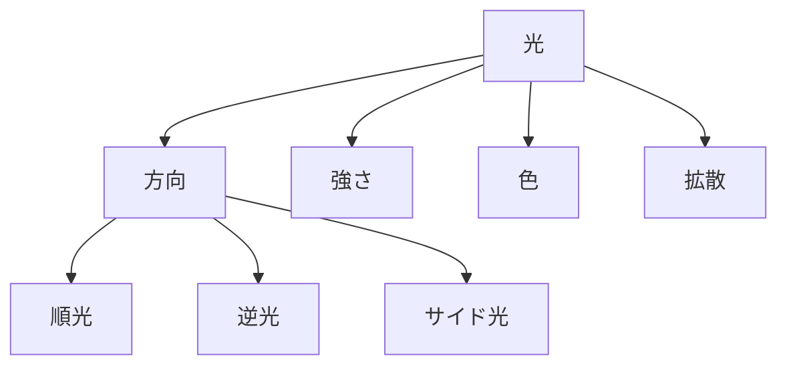

# 光構造

写真は

**光の記録**

である。

---

# 光構造

---

# 光の種類

## 順光

被写体正面から光

特徴  
・色が出る

## 逆光

被写体の背後

特徴  
・シルエット

## サイド光

横から

特徴  
・立体感

# 一覧
- [[順光]]
- [[逆光]]
- [[サイド光]] 
- [[柔光]]
- [[硬光]]
- [[Editing Structure]]
- [[ゴールデンアワー]]
- [[ブルーアワー]]
- [[人工光]]