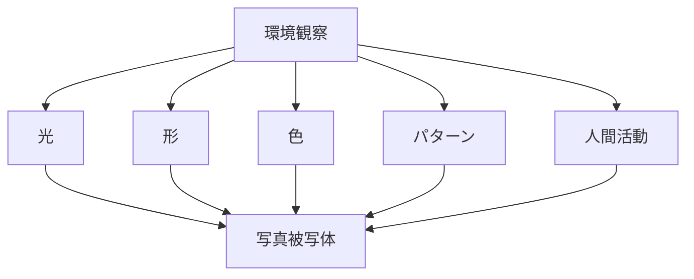

# 写真観察構造

写真の第一段階は

**何を見るか**

である。

---

# 観察構造

---

# 観察対象

## 光

- 太陽光
- 人工光
- 反射光

## 形

- 建築
- 地形
- 人物

## 色

- 色対比
- 色調

## パターン

- 繰り返し
- リズム

---

# 観察の問い

- 何が一番目立つか
- 光はどこから来ているか
- 視線はどこに向かうか

---

# 一覧
- [[被写体発見]]
- [[視覚パターン]]
- [[形の観察]]
- [[色の観察]]
- [[光の観察]]
- [[人間活動の観察]]
- [[空間構造の観察]]
- [[時間変化の観察]]
- [[写真ストーリー]]