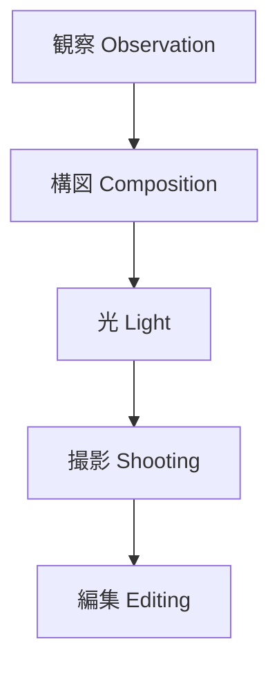

# 写真 Skill Hub

写真は

**観察 → 構図 → 光 → 撮影 → 編集**

の5段階で構成される。

---

# 全体構造

---

# ノート一覧

## 観察

- [[被写体発見]]
- [[視覚パターン]]
- [[写真ストーリー]]

## 構図

- [[三分割構図]]
- [[導線構図]]
- [[フレーミング構図]]
- [[前景構図]]

## 光

- [[順光]]
- [[逆光]]
- [[サイド光]]
- [[柔光]]
- [[硬光]]

## 撮影

- [[風景撮影]]
- [[人物撮影]]
- [[建築撮影]]
- [[旅行撮影]]

## 編集

- [[RAW現像]]
- [[トーン調整]]
- [[モノクロ編集]]