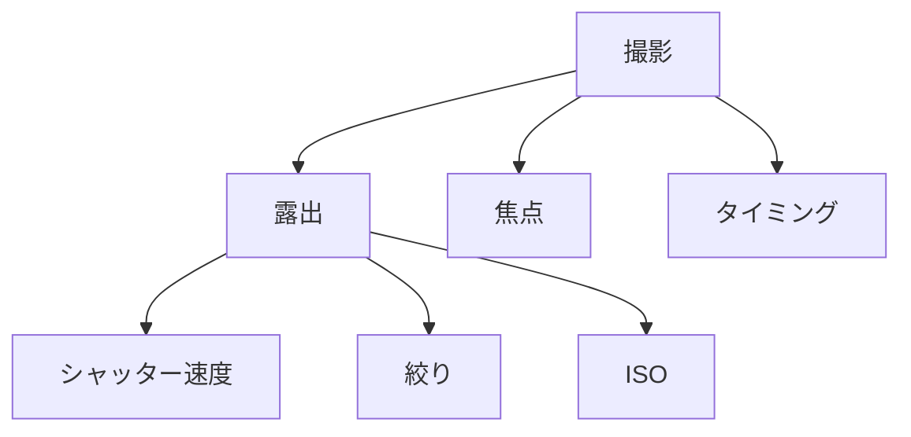

# 撮影構造

撮影とは

**設定 + 観察 + タイミング**

である。

---

# 撮影構造

```mermaid
graph TD

A[撮影]

A --> B[露出]
A --> C[焦点]
A --> D[タイミング]

B --> E[シャッター速度]
B --> F[絞り]
B --> G[ISO]
```

---

# 基本設定

## シャッター

動きを止める

## 絞り

被写界深度

## ISO

感度