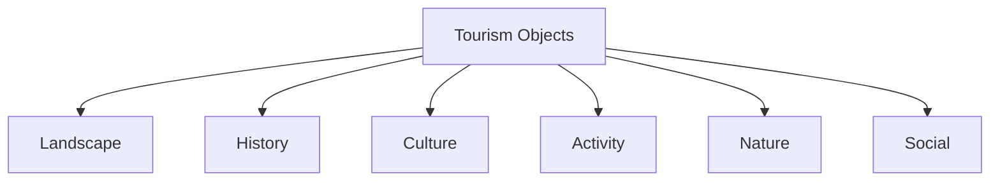
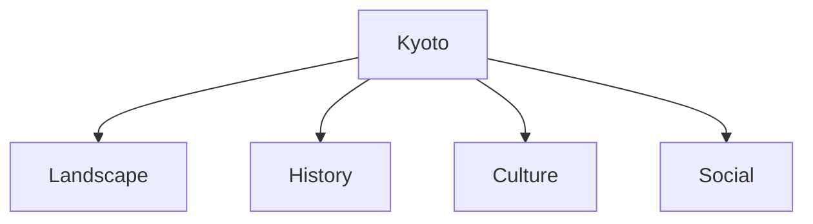
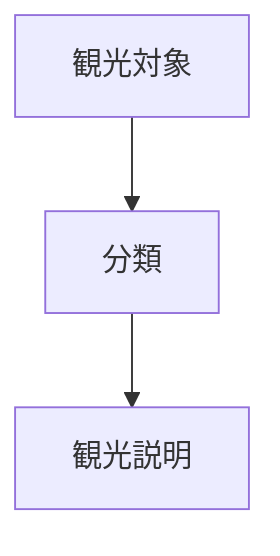

# Tourism Object Taxonomy

Tourism Object Taxonomy は、観光対象を  
**観光客が何を体験するか**によって分類する構造である。

観光地は

- 景観
- 歴史
- 文化
- 体験
- 自然
- 社会交流

の6種類の体験によって整理できる。

---

# 構造

---

# 1 景観型  
Landscape

観光客が

**見る・歩く**

ことで体験する観光。

## 景観地

- 展望地
- 夜景地

## 地形景観

- 海岸景観
- 山岳景観
- 湖沼景観
- 渓谷
- 滝

## 農村景観

- 棚田
- 農村景観

## 季節景観

- 桜名所
- 紅葉地
- 花景観

---

# 2 歴史型  
Historical

観光客が

**過去を見る**

観光。

## 城郭系

- 城郭
- 城跡

## 歴史都市

- 城下町
- 宿場町
- 港町

## 町並み

- 重伝建
- 町並み保存地区

## 遺構

- 遺跡
- 古戦場
- 産業遺産

## 廃墟

- 廃墟
- ゴーストタウン

---

# 3 宗教・文化型  
Cultural / Religious

観光客が

**意味や文化を理解する**

観光。

## 宗教

- 神社
- 寺院
- 霊場
- 巡礼

## 聖地

- 聖地
- 宗教都市

## 文化施設

- 美術館
- 博物館
- 文化施設

---

# 4 体験型  
Activity

観光客が

**何かをする**

観光。

## 温泉

- 温泉地
- 湯治場
- サウナ施設

## 文化体験

- 工芸体験
- ものづくり体験

## 生産体験

- 農業体験
- 漁業体験

## 乗り物

- 鉄道体験
- 船
- ロープウェイ

---

# 5 自然体験型  
Nature Activity

観光客が

**自然の中に入る**

観光。

## 自然地域

- 森林
- 国立公園
- ジオパーク

## 山

- トレッキング
- 登山

## 水

- 川遊び
- 海水浴

---

# 6 社会交流型  
Social Interaction

観光客が

**地域社会と交流する**

観光。

## 行事

- 祭り
- 地域イベント

## 市場

- 市場
- 朝市

## 飲食文化

- 居酒屋街
- 屋台街

## 日常生活

- 商店街
- 地域生活体験

---

# 観光対象の複合構造

多くの観光地は複数の分類を持つ。

例：京都

---

# 観光説明との接続

この分類は  
[[Tourism Explanation Structure]] と接続する。

---

# 一言で言うと

観光地とは

**見る・知る・体験する・自然に入る・交流する場所**

である。