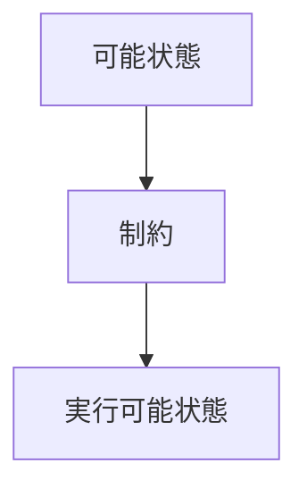
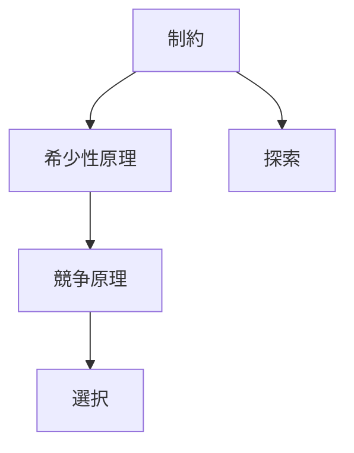

# 制約

## 定義

システム・主体・過程が取りうる状態や行動を  
**制限する条件・境界・資源の制限**

を **制約（Constraint）** という。

---

# 基本構造



制約とは

```
可能性
↓
制限
↓
実行可能性
```

を決める要素である。

---

# 制約の本質

## 1 行動空間を決める

制約は

```
何ができるか
何ができないか
```

を決める。

---

## 2 選択を生む

もし制約がなければ

```
最適化
選択
意思決定
```

は意味を持たない。

---

## 3 構造を生む

多くの秩序は

```
制約
+
相互作用
```

によって生まれる。

---

# 制約の種類

## 資源制約

例

- エネルギー
- 時間
- 資金
- 労働

---

## 情報制約

例

- 不完全情報
- 認知制限
- ノイズ

---

## 物理制約

例

- 空間
- 速度
- 重力
- 摩擦

---

## 制度制約

例

- 法律
- 規則
- 契約
- 権限

---

## 社会制約

例

- 規範
- 評判
- 文化

---

# kernelとの関係



---

# 制約と探索

探索は

```
制約の中
```

で行われる。

制約が強いほど

```
探索空間
↓
小さくなる
```

---

# 制約と選択

選択は

```
可能な選択肢
```

の中で起きる。

制約は

```
選択肢集合
```

を決める。

---

# 制約と最適化

最適化問題は

```
目的関数
+
制約条件
```

で構成される。

---

# 各分野の例

## 生物

- エネルギー制約
- 生存環境

---

## 経済

- 予算制約
- 資源制約

---

## 社会

- 法制度
- 規範

---

## 技術

- 計算能力
- 通信帯域

---

## 組織

- 人員
- 予算
- 時間

---

# mechanism

制約から生まれるメカニズム

- 選択メカニズム
- トレードオフメカニズム
- 最適化メカニズム
- 資源配分メカニズム

---

# pattern

制約から現れる典型パターン

- 競争
- 効率化
- ボトルネック
- 資源集中

---

# case

- 予算制約
- 生態系の資源制限
- 企業の人員制限
- 計算資源制限

---

# 見分けるための問い

- 何が行動を制限しているか
- 何が不足しているか
- どの範囲まで可能か
- 制約を変えると何が変わるか

---

# 要約

制約とは

**システムや主体が取りうる状態や行動を制限する条件**

である。

多くの現象は

```
制約
+
相互作用
+
探索
```

によって形成される。