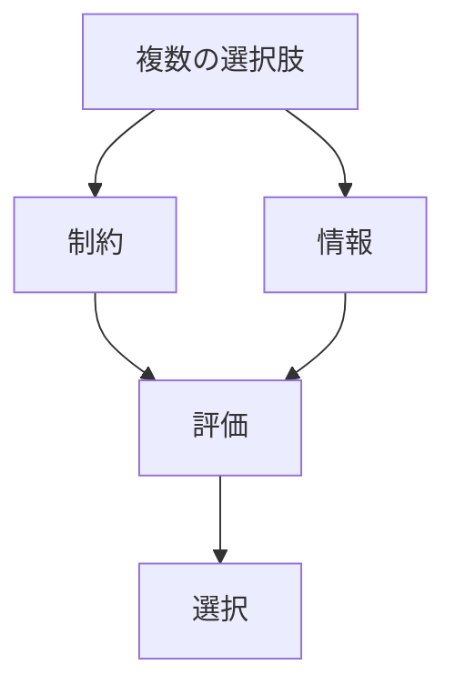
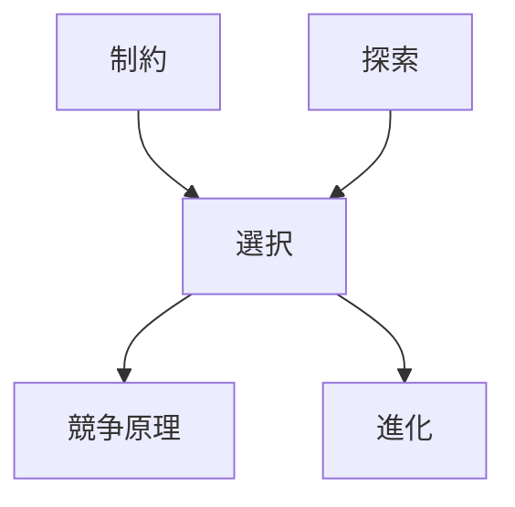

# 選択

## 定義

複数の可能な状態・行動・戦略の中から  
**一つまたは一部を採用する過程**

を **選択（Selection）** という。

---

# 基本構造



選択とは

```
選択肢
+
制約
+
情報
↓
評価
↓
決定
```

である。

---

# 選択の本質

## 1 不確実性の中で起こる

未来は完全には分からないため、  
選択は常に

```
不完全情報
```

のもとで行われる。

---

## 2 制約の中で行われる

選択は

```
可能な行動
```

の中からしか行えない。

つまり制約が

```
選択空間
```

を決める。

---

## 3 結果が差を生む

選択は結果として

```
成功
失敗
```

を生む。

その差が

```
淘汰
適応
```

につながる。

---

# kernelとの関係



---

# 選択と探索

探索は

```
可能な選択肢
```

を見つける過程。

選択は

```
その中から決める
```

過程。

つまり

```
探索
↓
選択
```

である。

---

# 選択と競争

競争は

```
複数主体
```

が同じ資源を求める状況。

その結果

```
選択
↓
成功者
```

が生まれる。

---

# 選択と進化

進化は

```
変異
+
選択
+
淘汰
```

によって起こる。

つまり選択は

```
進化の核心
```

である。

---

# 各分野の例

## 生物

- 生存戦略
- 配偶者選択

---

## 経済

- 投資判断
- 商品選択

---

## 社会

- 職業選択
- 政治選択

---

## 技術

- アルゴリズム選択
- 設計選択

---

## 組織

- 戦略決定
- 資源配分

---

# mechanism

選択に関係するメカニズム

- 意思決定メカニズム
- 最適化メカニズム
- ヒューリスティック
- トレードオフ調整

---

# pattern

選択から現れるパターン

- 集中
- 分化
- 勝者総取り
- 多様化

---

# case

- 企業の戦略選択
- 生物の生存戦略
- 市場の投資判断
- 個人の職業選択

---

# 見分けるための問い

- 選択肢は何か
- 制約は何か
- 情報は何か
- 評価基準は何か
- 選択の結果は何か

---

# 要約

選択とは

**複数の可能性の中から  
制約と情報に基づいて  
一つまたは一部を採用する過程**

である。