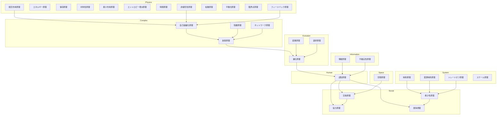

```mermaid
flowchart TB

%% 物理レベル
subgraph Physics
A1[相互作用原理]
A2[エネルギー原理]
A3[保存原理]
A4[対称性原理]
A5[最小作用原理]
A6[エントロピー増大原理]
A7[時間原理]
A8[非線形性原理]
A9[拡散原理]
A10[平衡化原理]
A11[臨界点原理]
A12[フィードバック原理]
end

%% 複雑系
subgraph Complex
B1[階層原理]
B2[ネットワーク原理]
B3[自己組織化原理]
B4[創発原理]
end

%% 進化
subgraph Evolution
C1[変異原理]
C2[選択原理]
C3[進化原理]
end

%% 人間
subgraph Human
D1[認知原理]
end

%% 社会
subgraph Social
E1[希少性原理]
E2[交換原理]
E3[協力原理]
E4[競争原理]
end

%% 情報
subgraph Information
F1[情報原理]
F2[不確実性原理]
end

%% 空間
subgraph Space
G1[空間原理]
end

%% システム
subgraph System
H1[制約原理]
H2[資源制約原理]
H3[トレードオフ原理]
H4[スケール原理]
end

%% 導出関係

A1 --> B3
A8 --> B3
A12 --> B3
B3 --> B4
B1 --> B4
B2 --> B4

B4 --> C3
C1 --> C3
C2 --> C3

C3 --> D1

D1 --> E2
D1 --> E3
D1 --> E4

F1 --> D1
F2 --> D1

G1 --> E2

H1 --> E1
H2 --> E1
H3 --> E1

E1 --> E4
E2 --> E3
```
