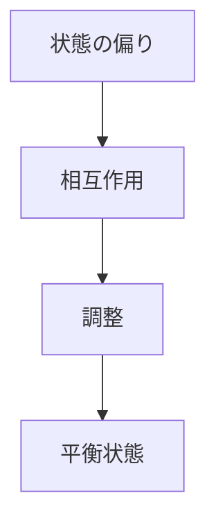
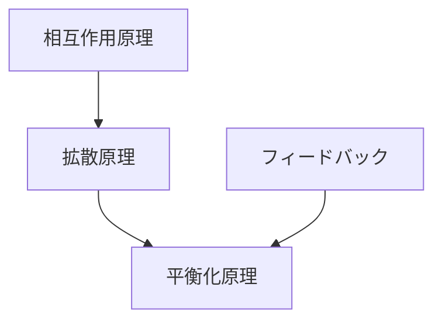

# 平衡化原理

## 定義

システムが内部相互作用や外部条件の影響を受けながら  
時間とともに

**安定した状態または均衡状態へ近づく傾向**

を **平衡化原理** という。

---

# 基本構造



つまり

```
偏り
↓
調整
↓
均衡
```

である。

---

# 平衡の種類

## 静的平衡

変化が止まり、状態が一定になる。

例  
化学平衡

---

## 動的平衡

状態は変化しているが、  
全体として安定している。

例  
生態系

---

## メタ安定

一時的に安定している状態。

例  
市場価格

---

# kernelとの関係



---

# 拡散原理との関係

拡散は

```
偏り
↓
広がり
```

を起こす。

その結果

```
分布均一
```

になる。

つまり

```
拡散
↓
平衡
```

である。

---

# フィードバックとの関係

負のフィードバックは

```
偏差
↓
修正
```

を行う。

これが

```
平衡
```

を生む。

---

# 各領域の例

## 物理

- 温度均一化
- 圧力均衡
- 化学平衡

---

## 生物

- 体温調節
- 生態系均衡

---

## 経済

- 需給均衡
- 市場価格調整

---

## 社会

- 権力均衡
- 制度均衡

---

## 都市・交通

- 交通流安定
- 土地利用均衡

---

# pattern

平衡化から現れるパターン

- 安定状態
- 均衡価格
- 動的均衡
- 振動収束

---

# case

- 市場価格調整
- 生態系バランス
- 温度均一化
- 都市交通流安定

---

# 見分けるための問い

- どんな偏りが存在するか
- それを調整する仕組みは何か
- どの状態が安定なのか
- 外部条件が変わるとどうなるか

---

# 要約

平衡化原理とは

**システムが相互作用を通じて安定した状態または均衡状態へ近づく傾向**

であり、  
自然・社会・経済の多くの現象を説明する基本原理である。