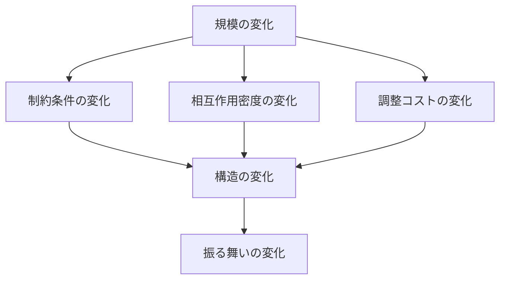
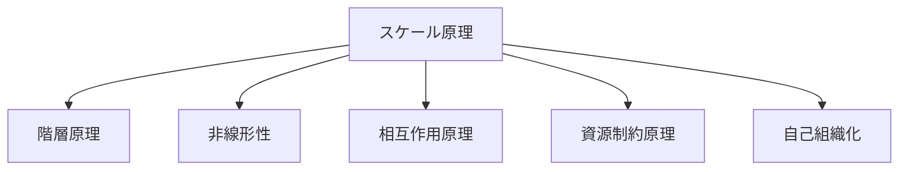

# スケール原理

## 定義

要素数・空間・時間・資源量などの**規模（scale）**が変わると、  
同じ対象でも

- 成立条件
- 支配的メカニズム
- 観察されるパターン
- 最適な構造や戦略

が変化する。

この原理を **スケール原理** という。

---

## 要点

スケール原理が言っているのは、単に

「大きいと違う」

ではない。

本質は

**規模が変わると、支配法則そのものが変わる**

ということである。

---

# 基本構造

---

# スケールの種類

## 1 空間スケール

対象の広がりが変わる。

例

- 部屋
- 建物
- 街区
- 都市
- 地域
- 国家

---

## 2 時間スケール

見る時間幅が変わる。

例

- 瞬間
- 日次
- 季節
- 年次
- 長期史

---

## 3 数量スケール

主体数・要素数が変わる。

例

- 1人
- 10人
- 100人
- 100万人

---

## 4 資源スケール

投入できる資源量が変わる。

例

- 小資本
- 中規模投資
- 大規模投資

---

# なぜスケールで法則が変わるのか

## 1 制約が変わる

小規模では問題でないことが  
大規模では致命傷になる。

例

- 1人なら口頭で済む
- 100人なら制度化が必要

---

## 2 相互作用数が増える

要素が増えると  
関係の数が急増する。

そのため

- 調整
- 監視
- 情報共有

が難しくなる。

---

## 3 局所最適と全体最適がズレる

小さな単位で最適でも  
全体では非効率になる。

---

## 4 新しい構造が必要になる

規模が大きくなると

- 階層
- 分業
- 標準化
- ルール化

が必要になる。

---

# 典型的な現れ方

## 小規模で有効だが大規模で壊れる

- 家族経営のやり方を大企業に持ち込む
- 小集団の合意形成を国家運営に持ち込む

---

## 大規模で有効だが小規模では重すぎる

- 厳格な官僚制
- 過剰な手続
- 多層承認

---

## スケールが変わると支配メカニズムが変わる

例

- 個人心理 → 集団心理
- 単体コスト → ネットワークコスト
- 局所交通 → 都市交通システム

---

# Kernelとの関係

---

# 他のkernelとの関係

## 階層原理

スケール拡大に伴って  
階層化が必要になる。

---

## 非線形性

規模が一定閾値を超えると  
連続的ではなく不連続に振る舞いが変わる。

---

## 相互作用原理

主体数が増えると  
相互作用の密度と複雑さが増す。

---

## 資源制約原理

大規模化すると  
資源配分の問題がより深刻になる。

---

## 自己組織化

一定スケール以上で  
局所相互作用から全体秩序が生まれることがある。

---

# 各領域での例

## 組織

- 5人のチームでは暗黙知で回る
- 500人の組織では制度と役割分担が必要

---

## 市場

- 小市場では相対取引が中心
- 大市場では価格メカニズムが支配的になる

---

## 都市

- 小集落では徒歩圏で完結
- 大都市では交通ネットワークが必要

---

## 技術

- 小規模システムでは手作業で管理可能
- 大規模システムでは自動化と監視基盤が必要

---

## 歴史・政治

- 都市国家と帝国では統治原理が異なる
- 領域拡大に伴い官僚制・法制度が必要になる

---

# mechanism

スケール原理と接続しやすいメカニズム

- 階層形成メカニズム
- 分業メカニズム
- 官僚化メカニズム
- 調整コスト増大メカニズム
- ネットワーク効果メカニズム

---

# pattern

スケール原理から現れやすいパターン

- 大規模化パターン
- 官僚化パターン
- 集中と分散の反復パターン
- ローカル最適化破綻パターン
- プラットフォーム化パターン

---

# case

- 家族商店から企業への変化
- 城下町から近代都市への変化
- 小規模アプリから大規模サービスへの移行
- 小共同体から官僚国家への移行

---

# 見分けるための問い

- この現象はどのスケールで成立しているか
- スケールが10倍になると何が壊れるか
- 小規模で成立する前提は何か
- 大規模化で必要になる構造は何か
- 局所最適と全体最適はズレていないか

---

# 要約

スケール原理とは、

**規模が変わると、制約・相互作用・最適構造が変わる**

という原理である。

したがって、ある対象を理解するには  
「何が起きているか」だけでなく

**どのスケールで見ているか**

