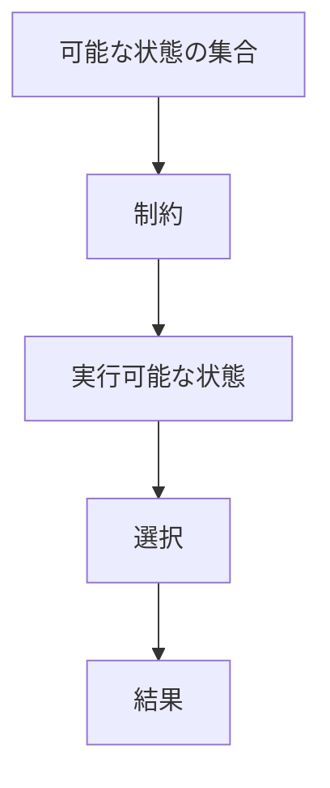
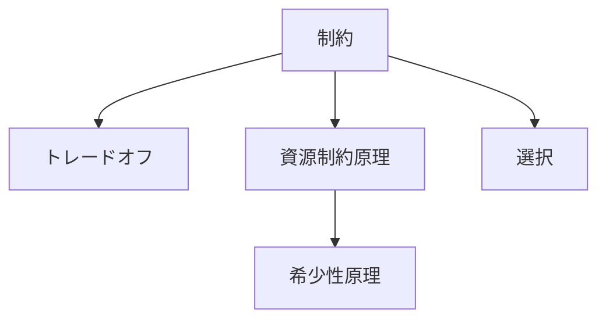

# 制約

## 定義

主体・システム・過程が取りうる状態、行動、構造を  
**制限する条件や境界**

を **制約** という。

簡単に言えば、

**何でもできるわけではない、という世界の条件**

である。

---

## 要点

制約は単なる不自由ではない。

本質は、

- 可能な行動を絞る
- 不可能な行動を排除する
- 選択を生む
- 構造を形作る

という点にある。

つまり制約は

**行動を妨げるもの**であると同時に  
**秩序を生むもの**でもある。

---

# 基本構造



---

# 制約の本質

## 1 可能性を削る

制約は  
すべての可能性の中から

**実際に取りうる範囲**

を決める。

---

## 2 選択を発生させる

制約がなければ

- 優先順位
- 配分
- 意思決定
- 最適化

は不要になる。

制約があるからこそ  
選択が必要になる。

---

## 3 構造を生む

制約の下では

- 効率化
- 分業
- 階層化
- 専門化

が起きやすい。

つまり多くの構造は

**制約への適応**

として生まれる。

---

# 制約の種類

## 物理制約

- 空間
- 重力
- 速度
- エネルギー

---

## 資源制約

- 時間
- 資金
- 労働力
- 土地

---

## 情報制約

- 不完全情報
- ノイズ
- 観測限界
- 認知限界

---

## 制度制約

- 法律
- 規則
- 契約
- 権限

---

## 社会制約

- 規範
- 評判
- 文化期待
- 地位秩序

---

# kernelとの関係



---

# 資源制約原理との関係

制約は上位概念であり、  
資源制約原理はその一類型である。

```text
制約
↓
資源制約原理
↓
希少性原理
```

---

# 制約と選択

選択とは、

**制約の中で何を採るか**

である。

したがって選択を理解するには  
まず制約を特定しなければならない。

---

# 制約と探索

探索とは、

**制約条件の下で可能解を探すこと**

である。

制約が変われば  
探索空間も変わる。

---

# 各領域での例

## 生物

- エネルギー不足
- 生息環境
- 捕食圧

---

## 経済

- 予算
- 人手不足
- 設備限界

---

## 組織

- 決裁権限
- 人員配置
- 時間制約

---

## 技術

- 計算資源
- 通信帯域
- バッテリー

---

## 都市・地域

- 地形
- 用地
- 交通容量
- 財政力

---

# mechanism

制約と接続しやすいメカニズム

- 最適化
- 資源配分
- ボトルネック形成
- 選択メカニズム
- 調整メカニズム

---

# pattern

制約から現れやすいパターン

- ボトルネック
- 過密
- 奪い合い
- 効率化
- 役割分化

---

# case

- 予算制約下の事業計画
- 労働力不足の物流
- 用地制約下の都市形成
- 計算資源制約下のAI運用

---

# 見分けるための問い

- 何がこの対象の可能性を狭めているか
- 何が不足しているか
- どこが限界になっているか
- 制約が外れると何が変わるか
- この制約は物理的か、制度的か、情報的か

---

# 要約

制約とは、

**主体やシステムが取りうる状態・行動・構造を制限する条件**

である。

したがって現象を理解するには  
何が起きているかだけでなく、

**何ができないのか**
**どこに限界があるのか**

を見る必要がある。