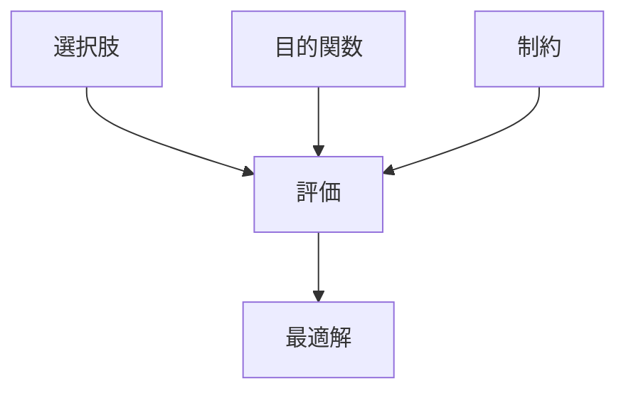
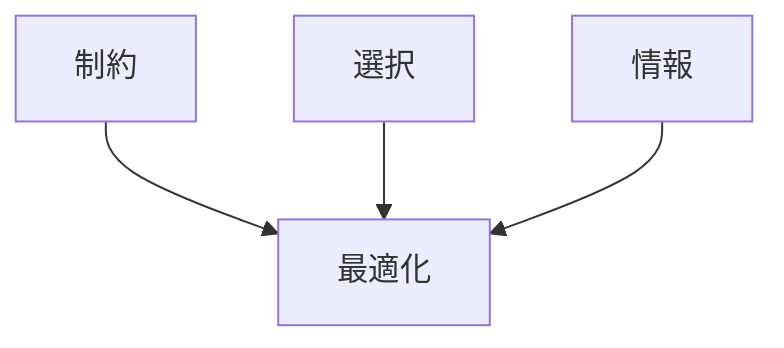

# 最適化

## 定義

与えられた

- 目的
- 制約

の下で

**最も望ましい状態を見つける過程**

を **最適化（Optimization）** という。

---

# 基本構造



---

# 最適化の基本形

最適化問題は通常

```
目的関数
+
制約
```

で構成される。

例

```
利益 最大化
コスト 最小化
距離 最短化
時間 最小化
```

---

# kernelとの関係



---

# 最適化と探索

最適解が分からない場合

```
探索
↓
評価
↓
改善
```

という反復が行われる。

---

# 各分野の例

## 生物

- エネルギー効率
- 行動戦略

---

## 経済

- 利益最大化
- コスト最小化

---

## 工学

- 経路最短化
- 設計最適化

---

## AI

- 損失関数最小化
- 強化学習

---

# pattern

最適化から現れるパターン

- 効率化
- 資源集中
- 局所最適
- 最適戦略

---

# case

- 企業の利益最大化
- ナビの最短経路
- 投資ポートフォリオ
- 機械設計

---

# 見分けるための問い

- 何を最大化／最小化しているか
- 制約は何か
- 評価基準は何か
- 局所最適の可能性はあるか

---

# 要約

最適化とは

**制約の下で目的を最もよく達成する状態を探す過程**

である。