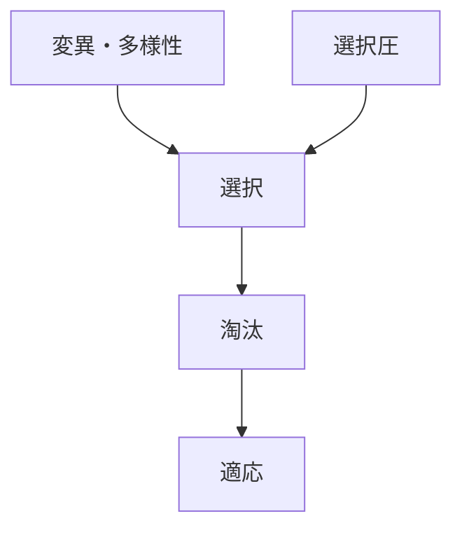
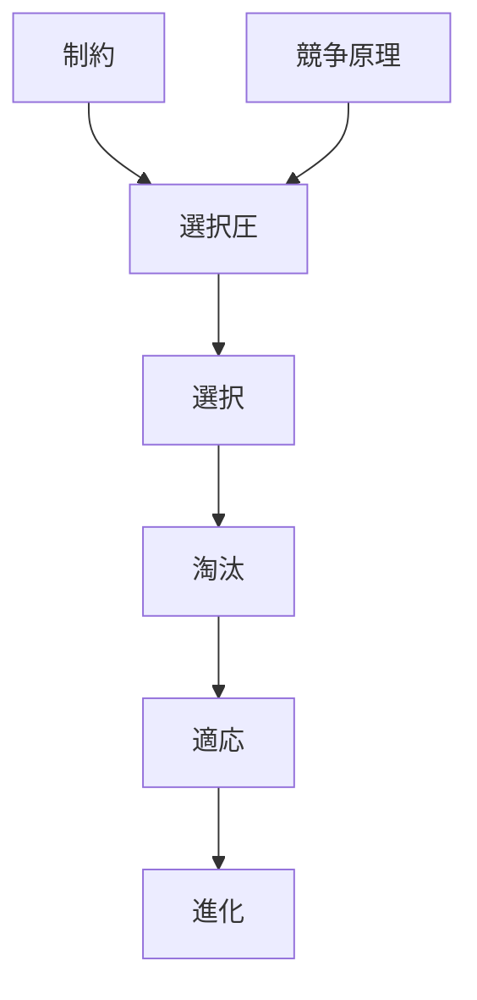

# 淘汰

## 定義

環境条件や競争の結果として  
ある形質・行動・戦略を持つ個体や主体が

**生存・繁殖・存続に失敗し消えていく過程**

を **淘汰（Elimination / Natural Selection Outcome）** という。

---

# 基本構造



---

# 淘汰の本質

淘汰とは

```
成功するものが残る
失敗するものが消える
```

という結果である。

つまり

**選択の結果として起こる排除過程**

である。

---

# 淘汰が起きる条件

## 資源制約

資源が有限であると

```
すべては生き残れない
```

---

## 競争

複数主体が同じ資源を求めると

```
勝者
敗者
```

が生まれる。

---

## 環境条件

環境に適さない形質は

```
生存率低下
```

を起こす。

---

# kernelとの関係



---

# 淘汰と適応

適応は

```
淘汰を通過した特徴
```

である。

つまり

```
淘汰
↓
適応
```

である。

---

# 各領域の例

## 生物

- 捕食に弱い個体の消滅
- 環境に合わない形質の消滅

---

## 経済

- 企業倒産
- 技術淘汰
- 市場退出

---

## 技術

- 古い規格の消滅
- 効率の悪い設計の消滅

---

## 社会

- 制度淘汰
- 組織淘汰

---

# pattern

淘汰から現れやすいパターン

- 勝者総取り
- 技術世代交代
- 市場集中
- 生態系均衡

---

# case

- 恐竜絶滅
- 抗生物質耐性菌の拡大
- VHS vs Betamax
- 企業淘汰

---

# 見分けるための問い

- 何が消えているか
- なぜ生き残れなかったか
- どの制約が淘汰を生んだか
- 生き残った特徴は何か

---

# 要約

淘汰とは

**環境条件や競争の結果として不利な主体が消えていく過程**

であり、  
適応と進化を生む重要なメカニズムである。