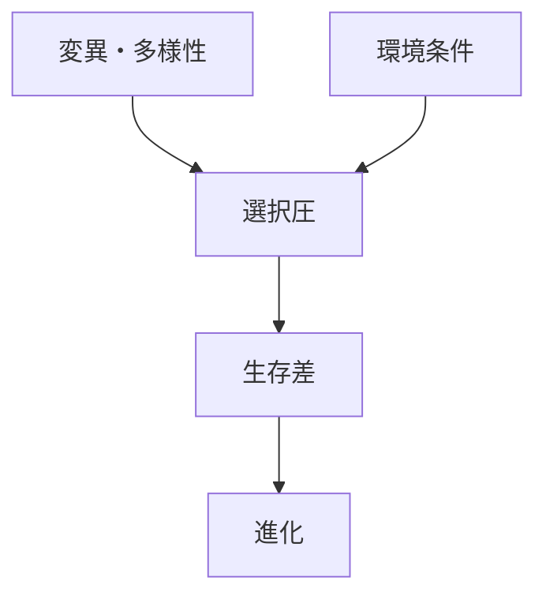
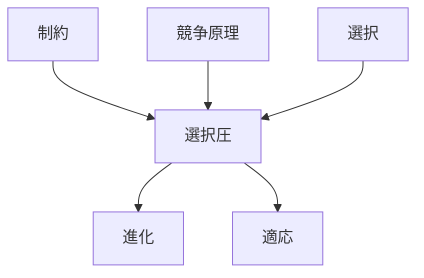

# 選択圧

## 定義

ある環境条件・制約・相互作用によって  
特定の形質・行動・戦略が

**有利または不利になる圧力**

を **選択圧（Selection Pressure）** という。

---

# 基本構造



---

# 選択圧の本質

選択圧とは

```
ある特徴が
有利になるか
不利になるか
```

を決める環境条件である。

---

# 選択圧の源

## 環境

例

- 気候
- 捕食者
- 食料

---

## 資源制約

例

- 食料不足
- 空間不足
- エネルギー不足

---

## 競争

例

- 繁殖競争
- 市場競争
- 技術競争

---

## 社会条件

例

- 評判
- 規範
- 地位

---

# kernelとの関係



---

# 選択圧と進化

進化は

```
変異
+
選択圧
```

によって起こる。

選択圧が変わると  
進化の方向も変わる。

---

# 選択圧と適応

適応とは

```
選択圧への対応
```

である。

---

# 各領域での例

## 生物

- 捕食圧
- 気候圧
- 食料競争

---

## 経済

- 市場競争
- 技術競争
- コスト圧

---

## 組織

- 評価制度
- 成果主義
- 人事競争

---

## 技術

- 性能競争
- 速度競争
- コスト競争

---

# pattern

選択圧から現れるパターン

- 適応
- 特化
- 淘汰
- 多様化

---

# case

- 長い首のキリン
- 抗生物質耐性菌
- 技術進化
- 企業淘汰

---

# 見分けるための問い

- 何が有利・不利を決めているか
- 環境条件は何か
- どの特徴が選ばれているか
- どの特徴が淘汰されているか

---

# 要約

選択圧とは

**特定の形質・行動・戦略を有利または不利にする環境条件**

であり、  
進化・適応・淘汰を生むメカニズムである。