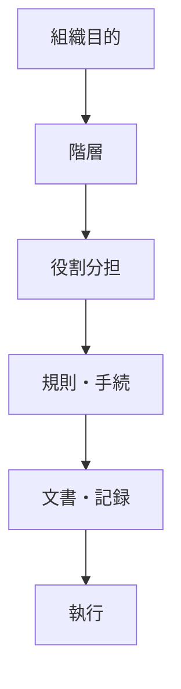
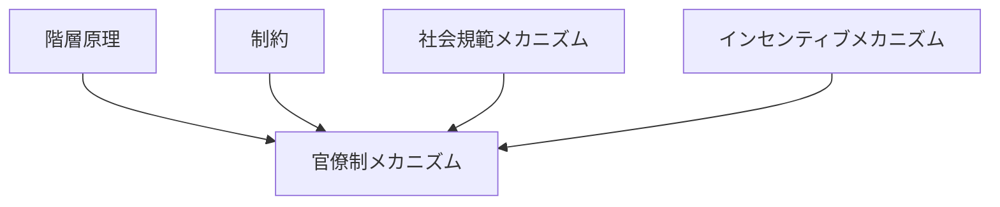

# 官僚制メカニズム

## 定義

大規模な組織や制度が、個人の裁量ではなく

- 役割
- 階層
- 規則
- 手続
- 文書

によって継続的に運営される仕組みを  
**官僚制メカニズム** という。

---

# 基本構造



つまり

```text
目的
↓
階層
↓
役割
↓
手続
↓
執行
```

である。

---

# 官僚制の本質

## 1 人ではなく役割で動かす

官僚制では

```text
誰がやるか
```

よりも

```text
どの役職がやるか
```

が重要になる。

これにより、個人が入れ替わっても組織は継続する。

---

## 2 裁量を規則に置き換える

官僚制は、場当たり的判断を減らし、

- 一貫性
- 予測可能性
- 公平性

を高めようとする。

そのため判断は

```text
規則
手続
基準
```

に従って行われる。

---

## 3 大規模組織の複雑性を処理する

要素数が増えると、全員が全体を把握して判断することはできない。

そのため官僚制は

- 分業
- 権限配分
- 文書化
- 中間管理

によって複雑性を処理する。

---

# 官僚制が生まれる条件

## 1 規模拡大

小集団では口頭や暗黙知で足りても、  
大組織では統一ルールが必要になる。

---

## 2 継続運営

一回限りではなく、反復的・長期的に運営する必要がある。

---

## 3 公平性要求

同じケースに同じ処理を求める圧力が強い。

---

## 4 責任の所在明確化

誰が決裁し、誰が実行し、誰が記録したかを残す必要がある。

---

# kernelとの関係



---

# 階層原理との関係

官僚制は  
大規模組織における階層原理の具体的実装である。

```text
規模拡大
↓
階層化
↓
官僚制
```

---

# 制約との関係

官僚制は

- 人数制約
- 情報制約
- 認知制約
- 時間制約

の下で組織を維持するために生まれる。

つまり官僚制は  
制約への適応形でもある。

---

# インセンティブとの関係

官僚制では個人の行動は

- 昇進
- 評価
- 処分
- 決裁権

によって方向づけられる。

そのため官僚制は、形式的には規則で動くが、実際には  
インセンティブの設計にも強く依存する。

---

# 社会規範との関係

官僚制が機能するには、

- 手続遵守
- 文書重視
- 権限尊重
- 職務分離

といった規範が必要である。

---

# 官僚制の利点

## 一貫性

人によって処理が大きく変わりにくい。

---

## 継続性

担当者が変わっても組織が回る。

---

## 追跡可能性

記録が残るため、後で検証できる。

---

## 大規模処理

大量案件を一定基準で処理できる。

---

# 官僚制のコスト

## 硬直化

例外対応が苦手になる。

---

## 手続肥大

本来の目的より手続維持が優先されることがある。

---

## 情報遅延

階層を通ることで現場情報が遅れたり歪んだりする。

---

## 責任回避

役割分担が細かいほど、誰も全体責任を負わなくなることがある。

---

# 各領域での例

## 国家

- 行政機関
- 許認可制度
- 税務処理

---

## 企業

- 稟議
- 承認フロー
- 人事制度

---

## 学校・病院

- 記録管理
- 標準手順
- 階層的指揮

---

## 交通・安全

- 点呼
- 運行管理
- 安全記録
- 監査対応

---

# pattern

官僚制メカニズムから現れやすいパターン

- 意思決定遅延
- 責任回避
- サイロ化
- 手続過剰
- 形式主義

---

# case

- 行政許認可手続
- 大企業の稟議制度
- 学校の事務処理
- 病院の記録運用
- 運輸安全マネジメント制度

---

# 見分けるための問い

- この組織は人ではなく役割で動いているか
- 権限はどのように階層配分されているか
- 判断は規則と手続に依存しているか
- 文書や記録はどれほど重視されているか
- 目的達成より手続維持が優先されていないか

---

# 要約

官僚制メカニズムとは

**大規模組織が階層、役割、規則、手続、文書によって継続的に運営される仕組み**

であり、

```text
規模拡大
↓
階層化
↓
役割分担
↓
手続運用
↓
継続的執行
```

という形で  
複雑な組織を安定的に動かす一方、硬直化や遅延も生みうる。