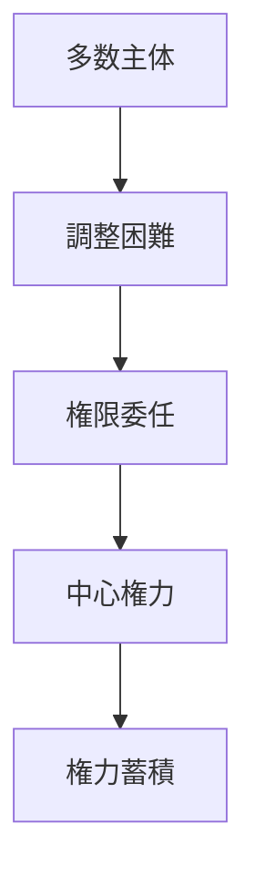
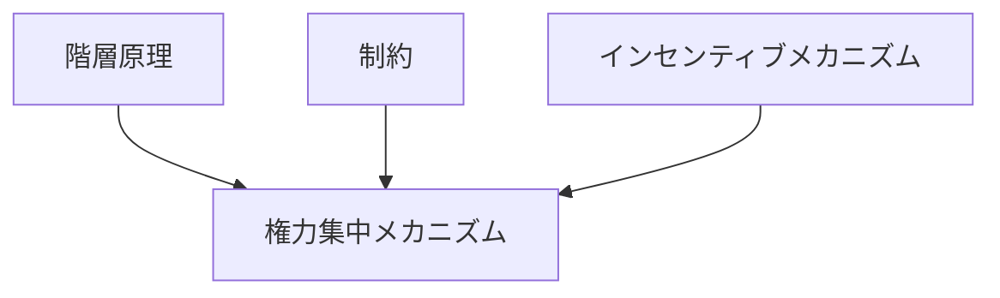

# 権力集中メカニズム

## 定義

社会・国家・組織において

- 意思決定権
- 強制力
- 資源配分権

などの **権力が少数の主体に集まっていく過程** を  
**権力集中メカニズム** という。

---

# 基本構造



つまり

```text
多数主体
↓
調整コスト
↓
権限委任
↓
中心権力
↓
権力集中
```

という流れである。

---

# 権力とは何か

権力とは

```
他者の行動を左右できる能力
```

であり、

- 強制力
- 資源配分
- 制度制定
- 情報統制

などによって構成される。

---

# 権力集中が起こる理由

## 1 調整コスト削減

多数主体が直接意思決定すると

```
調整コスト
```

が高くなる。

そのため意思決定を  
中心に集める圧力が生まれる。

---

## 2 強制力の集中

秩序維持のためには

```
暴力の独占
```

が必要になる。

例

- 国家
- 軍
- 警察

---

## 3 資源管理

資源分配を統一するため  
中央管理が形成される。

---

## 4 危機対応

戦争や危機の際には

```
迅速な意思決定
```

のために権力集中が起こりやすい。

---

# kernelとの関係



---

# 階層原理との関係

権力集中は

```
階層構造
```

を形成する。

```text
多数主体
↓
階層形成
↓
権力集中
```

---

# 制約との関係

情報制約・時間制約のため  
全員が全ての決定を行うことは不可能である。

その結果

```
意思決定権限
```

が集中する。

---

# インセンティブとの関係

権力を持つ主体は

```
権力維持インセンティブ
```

を持つため、

- 権限拡張
- 権力保持

を行う傾向がある。

---

# 官僚制との関係

権力集中はしばしば

```
官僚制
```

を通じて制度化される。

中央権力が  
階層組織を通じて統治する。

---

# ルール執行との関係

権力集中が進むと

```
ルール執行能力
```

が強化される。

国家が

- 警察
- 裁判
- 行政

を独占する場合が典型。

---

# 権力集中のパターン

## 漸進的集中

徐々に権力が中央に集まる。

例  
行政権限の拡大。

---

## 危機集中

危機時に一時的に集中。

例  
戦時体制。

---

## 制度集中

憲法や制度によって固定される。

例  
中央集権国家。

---

# 各領域での例

## 国家

- 絶対王政
- 中央集権国家
- 強い大統領制

---

## 組織

- CEO権限集中
- 創業者支配

---

## 社会

- 権威的指導者
- 宗教権威

---

# pattern

権力集中メカニズムから現れるパターン

- 権威支配
- 中央集権
- 権力固定化
- 権力濫用

---

# case

- 絶対王政
- 一党支配
- 創業者支配企業
- 軍事独裁

---

# 見分けるための問い

- 誰が最終意思決定を持つか
- 権限はどの程度分散しているか
- 強制力はどこに集中しているか
- 権力を制限する制度はあるか
- 危機時に権力はどこに集まるか

---

# 要約

権力集中メカニズムとは

**意思決定権・強制力・資源配分権が少数の主体に集まり、統治や組織運営が中央化される仕組み**

であり、

```text
多数主体
↓
調整コスト
↓
権限委任
↓
中心権力
↓
権力集中
```

という過程を通じて  
政治・組織・社会の統治構造が形成される。