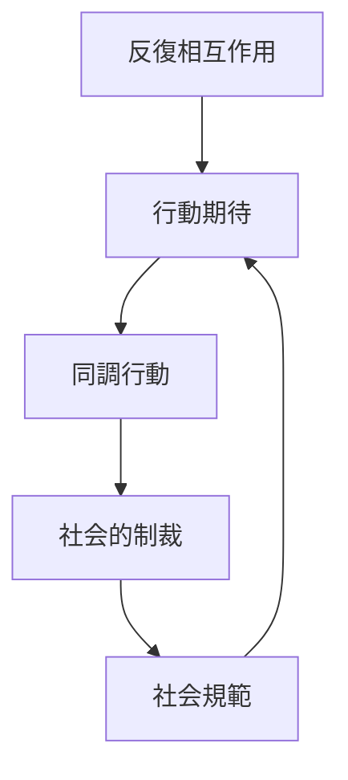
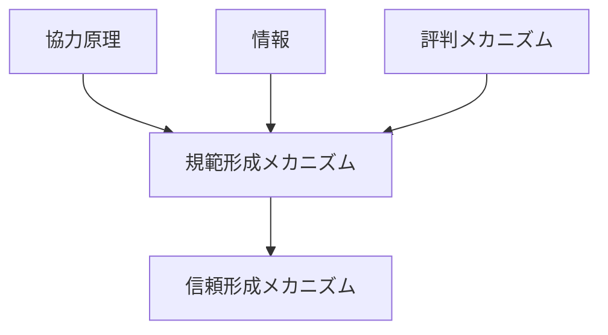

# 規範形成メカニズム

## 定義

社会において

- 「こうするべき」
- 「こうしてはいけない」

という **共有された行動基準（規範）** が  
人々の相互作用を通じて形成される仕組みを  

**規範形成メカニズム** という。

---

# 基本構造



つまり

```text
相互作用
↓
行動期待
↓
同調
↓
制裁
↓
規範定着
```

という循環である。

---

# 規範とは何か

規範とは

```
社会的に期待される行動
```

であり、

- 法律
- 慣習
- マナー
- 道徳

などとして存在する。

---

# 規範形成のプロセス

## 1 行動パターンの出現

人々の相互作用の中で

```
特定の行動
```

が繰り返される。

---

## 2 行動期待の形成

その行動が

```
普通の行動
```

として期待される。

---

## 3 同調

人々は

```
他者の期待
```

に合わせて行動する。

---

## 4 社会的制裁

規範違反は

- 非難
- 排除
- 評判低下

などによって罰せられる。

---

## 5 内面化

最終的に規範は

```
道徳
```

として内面化される。

---

# kernelとの関係



---

# 協力原理との関係

規範は

```
協力を安定化する仕組み
```

として生まれる。

例

- 順番を守る
- 嘘をつかない
- 約束を守る

---

# 評判との関係

規範違反は

```
評判低下
```

を生む。

そのため規範遵守が促進される。

---

# 信頼との関係

規範が共有される社会では

```
相手も同じ規範に従う
```

という期待が成立するため  
信頼が形成される。

---

# 情報拡散との関係

規範は

```
模倣
↓
情報共有
```

によって拡散する。

---

# ルール執行との関係

規範は

- 法的制裁
- 社会的制裁

の両方によって維持される。

---

# 規範形成のパターン

## 自発的規範

自然に形成される。

例  
交通マナー。

---

## 制度化規範

制度によって定着する。

例  
法律。

---

## 文化規範

長い時間をかけて形成される。

例  
礼儀。

---

# 各領域での例

## 社会

- マナー
- 礼儀
- 社会常識

---

## 組織

- 職場文化
- 行動規範

---

## 国家

- 法律
- 公共倫理

---

## オンライン

- コミュニティルール
- SNSマナー

---

# pattern

規範形成メカニズムから現れるパターン

- 同調圧力
- 道徳秩序
- 社会的制裁
- 文化形成

---

# case

- 列の順番
- 交通マナー
- SNSコミュニティルール
- 職場文化

---

# 見分けるための問い

- どの行動が「普通」と期待されているか
- 規範違反はどのように罰せられるか
- 規範は法か慣習か
- 規範はどのように広がったか
- 規範は内面化されているか

---

# 要約

規範形成メカニズムとは

**相互作用・期待・同調・社会制裁を通じて社会の行動基準が形成される仕組み**

であり、

```text
相互作用
↓
行動期待
↓
同調
↓
社会制裁
↓
規範定着
```

という過程を通じて  
社会秩序や協力が維持される。