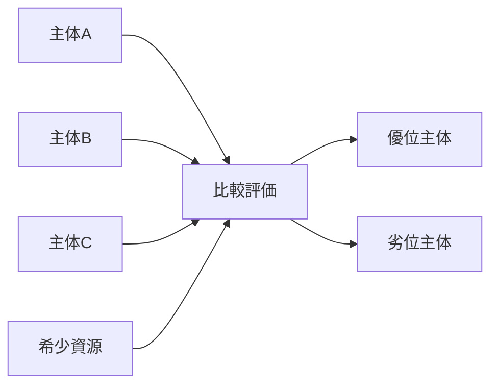

# Competition Mechanism

Competition Mechanism（競争メカニズム）とは、複数主体が同一の希少資源、地位、顧客、権力、評価をめぐって優位を争う仕組みである。

競争は単なる対立ではなく、選抜・革新・淘汰を生む一方で、消耗・格差拡大・過剰最適化も引き起こす。

---

# 概要

競争は、資源が希少であり、かつ主体間の成果が比較可能なときに生じやすい。  
その結果、主体は能力改善、差別化、速度向上、価格調整などを通じて優位確保を目指す。

競争メカニズムの核心は、

1. 希少資源
2. 比較可能性
3. 選抜基準
4. 優位獲得
5. 敗者排除または再挑戦

にある。

---

# Kernel

- [[資源希少性原理]]
- [[利益追求原理]]
- [[選抜原理]]
- [[比較評価原理]]

---

# 基本構造

---

# メカニズム

## 1. 希少性の発生
全員が同時に十分な資源を得られないとき、競争が発生する。

## 2. 比較評価の制度化
価格、試験、得票、シェア、軍事力などの指標により主体同士が比較される。

## 3. 優位獲得のための適応
主体は資源投入、差別化、効率化、情報収集によって勝率を高めようとする。

## 4. 勝者集中
勝者が追加資源や信用を得ることで、次の競争でも有利になる。

## 5. 敗者排除またはニッチ化
敗者は撤退するか、別市場・別ルール・別戦略へ移動する。

---

# 成立条件

- 希少資源が存在する
- 評価基準が共有されている
- 主体間に参入可能性がある
- 成果差が可視化される
- 勝敗が資源配分に反映される

---

# 失敗条件

- 比較基準が壊れている
- 参入障壁が固定化している
- 勝敗が能力ではなく恣意で決まる
- 独占で競争圧力が消滅している
- 競争コストが便益を超える

---

# 発生するPattern

- [[市場競争]]
- [[02_zettelkasten/01_knowledge/world_model/pattern/market/価格競争]]
- [[軍拡競争]]
- [[選挙競争]]
- [[受験競争]]
- [[地位競争]]

---

# Case

- IT企業のシェア争い
- 国家間覇権競争
- 入札競争
- SNSでの注目獲得競争
- 大学入試

---

# 関連ノート

- [[Selection Mechanism]]
- [[Positive Feedback Mechanism]]
- [[02_zettelkasten/01_knowledge/world_model/mechanism/institutional/権力集中メカニズム]]
- [[Lock-in Mechanism]]