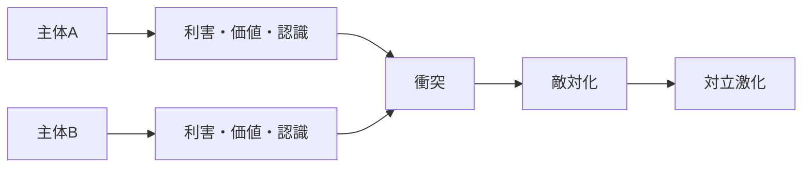

# Conflict Mechanism

Conflict Mechanism（対立メカニズム）とは、主体間の利害、価値、認識、身份が衝突し、協力や共存の秩序が破綻して敵対関係が形成・激化する仕組みである。

---

# 概要

対立は単に意見が違うことではない。  
互いに両立しない利益や価値が前面化し、相手の行動を脅威として知覚したときに本格化する。

対立メカニズムの核心は、

1. 利害衝突
2. 認識の敵対化
3. 集団境界の強化
4. 応酬の反復
5. 妥協可能性の低下

にある。

---

# Kernel

- [[利害衝突原理]]
- [[アイデンティティ原理]]
- [[脅威知覚原理]]
- [[相互不信原理]]

---

# 基本構造

---

# メカニズム

## 1. 利害の非両立化
資源、権力、領域、評価などが両立困難な形で争点化する。

## 2. 脅威知覚
相手の存在や行動が、自分の地位や安全を脅かすものとして認識される。

## 3. 意味付けの敵対化
相手の行動が単なる違いではなく、悪意・侵害・侮辱として解釈される。

## 4. 集団境界の硬化
「我々」と「彼ら」の線引きが強まり、内集団結束と外集団敵視が高まる。

## 5. 応酬による拡大
一方の防御や報復が、他方には攻撃として知覚され、相互増幅が起こる。

---

# 成立条件

- 利害や価値の対立軸が明確
- 相互不信が強い
- 妥協の仲介装置が弱い
- 動員可能な支持集団がある
- 報復が政治的・感情的に正当化される

---

# 失敗条件（対立が深まらない条件）

- 利害調整制度が機能する
- 相手の合理性が認められている
- 共通利益が上位にある
- 第三者仲裁が信頼されている
- 対立コストが高すぎる

---

# 発生するPattern

- [[政治対立]]
- [[派閥抗争]]
- [[民族紛争]]
- [[階級対立]]
- [[02_zettelkasten/01_knowledge/world_model/pattern/social/case/炎上]]
- [[安全保障ジレンマ]]

---

# Case

- 労使紛争
- 国境紛争
- 社内派閥対立
- 文化戦争
- SNS上の集団対立

---

# 関連ノート

- [[Competition Mechanism]]
- [[Collective Action Mechanism]]
- [[02_zettelkasten/01_knowledge/world_model/mechanism/information/物語形成メカニズム]]
- [[02_zettelkasten/01_knowledge/world_model/mechanism/institutional/規範形成メカニズム]]