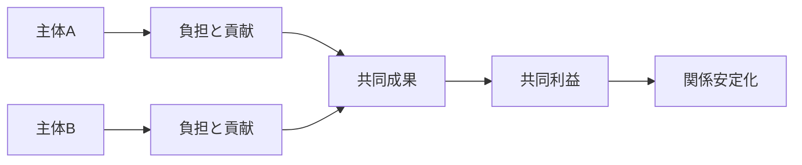

# Cooperation Mechanism

Cooperation Mechanism（協力メカニズム）とは、複数主体が単独では達成しにくい利益や目的のために、相互にコストを払いながら共同で行動する仕組みである。

調整が「行動を揃えること」に重点を置くのに対し、協力は「互いに便益を生むために資源や努力を出し合うこと」に重点がある。

---

# 概要

協力は自然には常に成立しない。  
各主体には、相手だけが負担して自分が得をする誘惑があるためである。  
したがって協力が成立するには、裏切りを抑制し、共同利益を安定化させる条件が必要になる。

協力メカニズムの核心は、

1. 共同利益の存在
2. 相互依存
3. 信頼または監視
4. 繰り返し関係
5. 制裁可能性

にある。

---

# Kernel

- [[相互利益原理]]
- [[相互依存原理]]
- [[信頼形成原理]]
- [[繰り返し相互作用原理]]

---

# 基本構造

---

# メカニズム

## 1. 共同利益の認識
各主体が、単独行動より共同行動の方が大きな便益をもたらすと理解する。

## 2. 相互依存の受容
自分の成果が相手の協力に依存していると認識することで、相手行動への関心が高まる。

## 3. 信頼の形成
相手が将来も協力する、あるいは裏切っても制裁されると期待できると、協力行動が選択されやすくなる。

## 4. 繰り返し関係による安定化
一回限りでは裏切りが有利でも、長期関係では信用損失が大きくなるため協力が維持される。

## 5. 制裁・排除の補完
裏切りへの罰、評判低下、参加資格停止などがあると協力秩序が維持されやすい。

---

# 成立条件

- 共同利益が明確である
- 貢献と便益の関係が理解されている
- 相互監視または透明性がある
- 繰り返し関係が見込まれる
- 裏切りへの制裁が可能である

---

# 失敗条件

- 便益配分が不公平
- 貢献の可視化ができない
- 裏切りが検出しにくい
- 一回限りの関係
- フリーライダーが放置される

---

# 発生するPattern

- [[共同生産]]
- [[同盟]]
- [[相互扶助]]
- [[チームワーク]]
- [[協同組合]]
- [[国際協定]]

---

# Case

- 共同研究
- サプライチェーン連携
- 国家間安全保障協力
- 地域消防団
- オープンソース開発

---

# 関連ノート

- [[Coordination Mechanism]]
- [[Trust Formation Mechanism]]
- [[Collective Action Mechanism]]
- [[Free Rider Mechanism]]