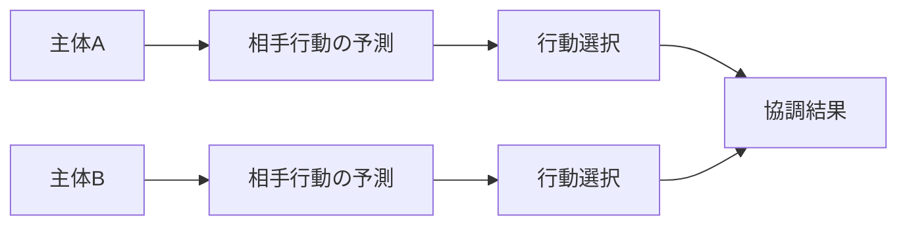

# Coordination Mechanism

Coordination Mechanism（調整メカニズム）とは、複数の主体が互いの行動を予測しながら、整合的な行動を選択することで秩序が成立する仕組みである。

社会の多くの秩序（交通、言語、慣習、市場など）は、このメカニズムによって維持される。

---

# 概要

調整は、主体間に必ずしも強い利他的意思がなくても成立する。  
重要なのは「相手が何をするか」を予測し、それに合わせて自分の行動を選べることである。

したがって調整メカニズムの核心は、

1. 相互期待
2. 共通ルール
3. 逸脱コスト
4. 協調均衡の安定化

にある。

---

# Kernel

- [[相互依存原理]]
- [[期待形成原理]]
- [[情報共有原理]]
- [[秩序形成原理]]

---

# 基本構造

---

# メカニズム

## 1. 相互期待の形成
各主体は、自分の望む結果だけでなく、相手が何を選ぶかを考慮する。  
このとき「相手も同じルールを知っている」という前提があるほど調整は容易になる。

## 2. 共通焦点の出現
複数の選択肢があっても、社会的に目立つ基準、既存慣習、制度的標識があると、特定の選択肢が焦点になる。  
これが調整コストを下げる。

## 3. 逸脱コストの発生
周囲と異なる行動を取ると事故、混乱、信用低下などのコストが生じる。  
そのため主体は個別最適より協調的選択を取りやすくなる。

## 4. 反復による安定化
同じ調整が繰り返されると、それは習慣・慣習・制度へと固定化される。  
以後は毎回深く考えなくても秩序が再生産される。

---

# 成立条件

- 主体同士が相互に観察可能である
- ある程度の共通知識がある
- ルールや期待が共有されている
- 協調しない場合のコストが高い
- 協調結果が反復される

---

# 失敗条件

- ルールが複数競合している
- 期待が揃っていない
- 情報が分断されている
- 逸脱に対するコストが低い
- 外部環境の変化で旧ルールが機能しない

---

# 発生するPattern

- [[交通秩序]]
- [[市場均衡]]
- [[社会慣習]]
- [[言語共有]]
- [[規格統一]]
- [[プロトコル収斂]]

---

# Case

- 左側通行
- 会議の発言順
- 駅ホームでの整列
- QWERTY配列の使用
- 商習慣としての請求締め日

---

# 関連ノート

- [[Cooperation Mechanism]]
- [[02_zettelkasten/01_knowledge/world_model/mechanism/institutional/規範形成メカニズム]]
- [[02_zettelkasten/01_knowledge/world_model/mechanism/institutional/ルール執行メカニズム]]
- [[Path Dependence Mechanism]]