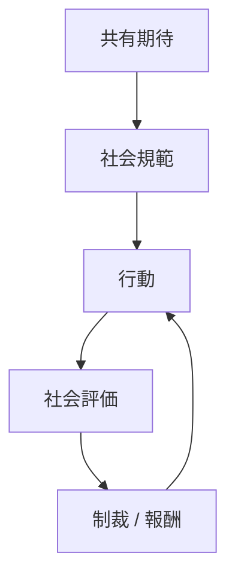
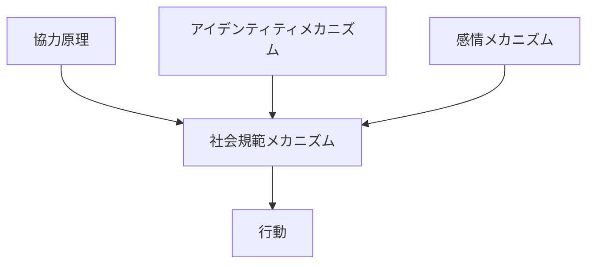

# 社会規範メカニズム

## 定義

集団の中で

- 望ましい行動
- 望ましくない行動

に関する共有された期待が形成され、  
それが

- 同調
- 評判
- 制裁

などを通じて行動を調整する仕組みを

**社会規範メカニズム**という。

---

# 基本構造



つまり

```
共有期待
↓
行動基準
↓
評価
↓
制裁 / 報酬
↓
行動調整
```

である。

---

# 社会規範の機能

## 1 行動の予測可能性

規範があることで

```
他者の行動
```

を予測できる。

例

- 交通ルール
- 礼儀

---

## 2 協力の維持

規範は

```
フリーライダー
```

を抑制する。

---

## 3 社会秩序

規範があることで

```
制度がなくても秩序が維持
```

される。

---

# 規範の形成

社会規範は

```
反復行動
↓
期待形成
↓
共有化
↓
規範化
```

という過程で形成される。

---

# kernelとの関係



---

# 協力との関係

社会規範は

```
協力行動
```

を維持する重要な仕組みである。

---

# アイデンティティとの関係

規範は

```
内面化
```

されると

```
自分の価値観
```

になる。

---

# 感情との関係

規範違反には

- 恥
- 罪悪感
- 怒り

が伴う。

これが規範を強化する。

---

# 規範の種類

## 記述的規範

「多くの人がしている行動」

例

- 列に並ぶ

---

## 命令的規範

「するべき行動」

例

- 嘘をつかない

---

# 各領域での例

## 日常社会

- マナー
- 礼儀

---

## 組織

- 職場文化
- プロフェッショナル倫理

---

## 経済

- 契約遵守
- 市場慣行

---

## コミュニティ

- SNSルール
- ファン文化

---

# pattern

社会規範から現れるパターン

- 同調行動
- 社会制裁
- 評判管理
- 文化形成

---

# case

- 列に並ぶ行動
- SNS炎上
- 職業倫理
- 地域慣習

---

# 見分けるための問い

- 集団はどの行動を期待しているか
- 違反すると何が起きるか
- 規範は明文化されているか
- 規範はどのように維持されているか
- 規範は誰に適用されるか

---

# 要約

社会規範メカニズムとは

**集団の共有期待が評価や制裁を通じて行動を調整する仕組み**

であり、

```
共有期待
↓
行動基準
↓
社会評価
↓
制裁 / 報酬
```

によって  
社会秩序や協力行動を維持する。