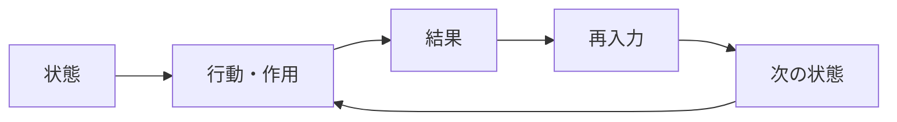

# Feedback Mechanism

Feedback Mechanism（フィードバックメカニズム）とは、システムのある時点の出力や結果が、次の時点の入力条件に再び作用し、以後の状態変化を方向づける仕組みである。

---

# 概要

システムは一方向に因果が流れるだけではない。  
ある結果が次の原因となり、それが再び新たな結果を生むことで、循環的な運動が成立する。  
この循環が、拡大・安定・振動・崩壊といった多様な動態を生む。

フィードバックメカニズムの核心は、

1. 状態
2. 行動または作用
3. 結果
4. 結果の再入力
5. 循環の継続

にある。

---

# Kernel

- [[因果循環原理]]
- [[自己調整原理]]
- [[自己強化原理]]
- [[動態変化原理]]

---

# 基本構造

---

# メカニズム

## 1. 現在状態の形成
ある時点での資源配分、認識、制度、需給、感情などがシステム状態を決める。

## 2. 作用の発生
その状態に基づいて主体が行動し、またはシステム内部の処理が進行する。

## 3. 結果の発生
作用の結果として、成長、損失、支持率変化、価格変動、信頼増減などが起こる。

## 4. 結果の再入力
その結果が次の行動条件や期待や制約を変える。

## 5. 循環の継続
以後、同じ因果経路が反復され、累積的変化または調整過程が生まれる。

---

# フィードバックの大別

## 正のフィードバック
変化を増幅する。

## 負のフィードバック
変化を抑制し安定方向へ戻す。

---

# 発生しやすい領域

- 市場価格
- 世論変動
- 組織学習
- 権力集中
- 生態系
- 技術普及

---

# 発生するPattern

- [[自己強化]]
- [[自己安定化]]
- [[好循環]]
- [[悪循環]]
- [[振動]]
- [[暴走]]

---

# Case

- 人気商品がさらに売れる
- 炎上が注目を呼びさらに拡散する
- 在庫調整で価格が戻る
- 学習が成果を生みさらに学習が進む

---

# 関連ノート

- [[Positive Feedback Mechanism]]
- [[Negative Feedback Mechanism]]
- [[Path Dependence Mechanism]]
- [[Adaptation Mechanism]]