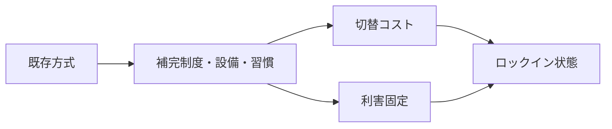

# Lock-in Mechanism

Lock-in Mechanism（ロックインメカニズム）とは、特定の技術、制度、規格、関係、行動様式が、切替可能性があるにもかかわらず、切替コスト・補完関係・既得利益・慣習により事実上抜け出しにくくなる仕組みである。

---

# 概要

経路依存が「過去の選択の拘束」を指すなら、ロックインはその拘束が高まり、代替が存在しても移行困難になった状態を強調する。  
ロックインは効率的な安定も生むが、環境変化に対して脆弱で、非効率や旧式構造を温存しやすい。

ロックインメカニズムの核心は、

1. 既存方式の普及
2. 補完資源の密着
3. 切替コスト
4. 利害固定
5. 代替排除

にある。

---

# Kernel

- [[切替コスト原理]]
- [[補完性原理]]
- [[既得権原理]]
- [[制度慣性原理]]

---

# 基本構造

---

# メカニズム

## 1. 既存方式への適応
人員、設備、教育、手順、文化が特定方式に最適化される。

## 2. 補完性の増加
周辺の技術や制度がその方式に接続し、単独ではなくシステム全体として固定される。

## 3. 切替コストの上昇
新方式への移行に資金、時間、政治コスト、混乱が伴う。

## 4. 利害の固定
現行方式で利益を得ている主体が変更に抵抗する。

## 5. 代替案の排除
代替方式は性能が高くても、採用障壁のため広がれない。

---

# ロックインの利点

- 互換性の確保
- 学習コストの低下
- 安定的運用
- 協調の容易化

---

# ロックインの問題

- 非効率の温存
- 革新阻害
- 脆弱性の蓄積
- 旧制度依存
- 危機時の切替困難

---

# 発生するPattern

- [[標準固定]]
- [[技術的惰性]]
- [[既得権抵抗]]
- [[移行失敗]]
- [[プラットフォーム依存]]
- [[制度閉塞]]

---

# Case

- 古い会計・基幹システムの更新困難
- 特定プラットフォーム依存
- ガラパゴス規格の残存
- 補助金制度への依存
- 旧来組織文化からの脱却困難

---

# 関連ノート

- [[Path Dependence Mechanism]]
- [[Positive Feedback Mechanism]]
- [[Institutional Drift Mechanism]]
- [[Adaptation Mechanism]]