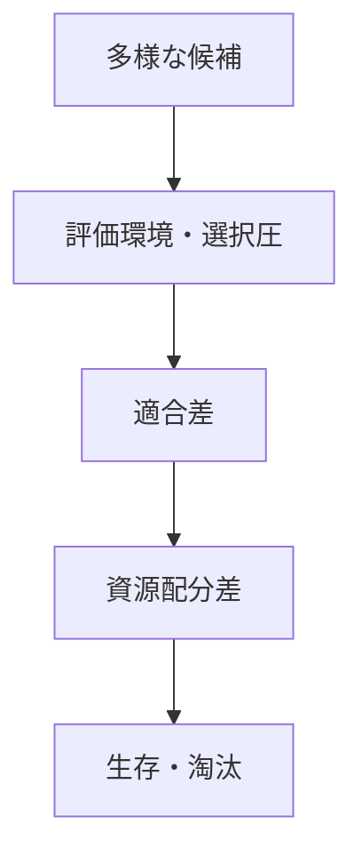

# Selection Mechanism

Selection Mechanism（選択メカニズム）とは、複数の主体、戦略、制度、技術、行動様式のうち、環境条件や評価基準により一部が生き残り、他が縮小・淘汰される仕組みである。

---

# 概要

選択は、必ずしも最善のものが勝つことを意味しない。  
その時点の環境により適合したもの、測定されやすいもの、資源を得やすいもの、制度に守られているものが残る。  
そのため、選択メカニズムは進歩も生むが、偏った評価軸による歪みも生む。

選択メカニズムの核心は、

1. 多様な候補の存在
2. 評価環境
3. 適合差
4. 資源配分差
5. 生存と淘汰

にある。

---

# Kernel

- [[選抜原理]]
- [[適合原理]]
- [[資源配分原理]]
- [[淘汰原理]]

---

# 基本構造

---

# メカニズム

## 1. 多様性の存在
異なる戦略、技術、組織形態、個体、制度案が並存する。

## 2. 評価環境の形成
市場、自然環境、制度、世論、試験、投票などが選別条件となる。

## 3. 適合差の発現
一部の候補は環境条件によりよく適合し、成果や存続率が高まる。

## 4. 資源の偏配
適合した候補に資金、人材、支持、注目、繁殖機会が集まる。

## 5. 残存と淘汰
優位な候補は拡大し、不利な候補は縮小・退出・消滅する。

---

# 選択の特徴

- 絶対的最適とは限らない
- 評価軸次第で結果が変わる
- 短期適合が長期最適と一致しないことがある
- 制度設計が選択圧を変える
- 多様性があるほど選択余地は広い

---

# 選択の歪み

- 測定しやすいものだけが残る
- 短期成果偏重
- 本質より信号が評価される
- 既存優位者が過剰に残る
- 多様性喪失により脆弱化する

---

# 発生するPattern

- [[市場淘汰]]
- [[受験選抜]]
- [[自然選択]]
- [[人事選抜]]
- [[技術標準化]]
- [[短期最適化]]

---

# Case

- 企業間競争での退出
- 求人市場での採用選抜
- 政党間競争での議席配分
- 研究資金配分によるテーマ選択
- 自然環境における種の残存差

---

# 関連ノート

- [[Competition Mechanism]]
- [[Positive Feedback Mechanism]]
- [[Adaptation Mechanism]]
- [[Path Dependence Mechanism]]