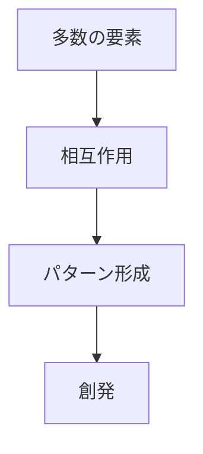
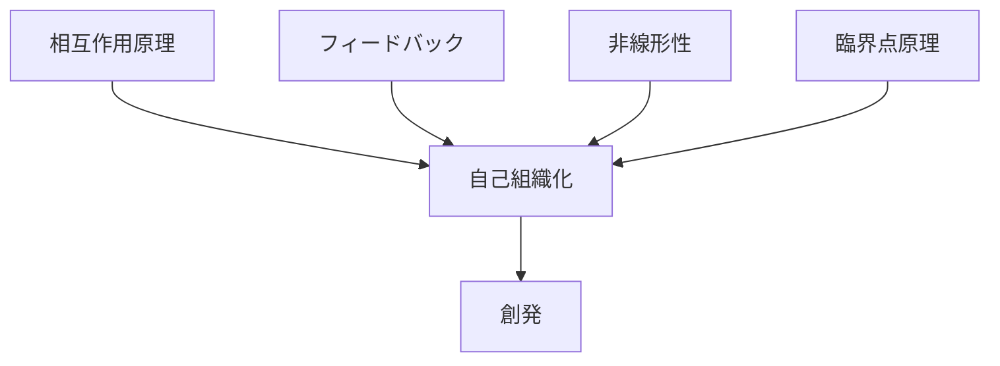

---
type:
kernel_domain: complexity
is_a:
  - "[[02_zettelkasten/01_knowledge/world_model/kernel/physics/相互作用原理]]"
explains:
  - システム秩序形成
  - 集団行動
  - パターン生成
  - 複雑系構造
causes:
  - "[[02_zettelkasten/01_knowledge/world_model/meta/kernel/complex/創発]]"
  - "[[集団パターン]]"
  - "[[構造形]]"
  - "[[02_zettelkasten/01_knowledge/world_model/meta/kernel/complex/自己組織化]]"
related_to:
  - "[[02_zettelkasten/01_knowledge/world_model/meta/kernel/complex/自己組織化]]"
  - "[[02_zettelkasten/01_knowledge/world_model/kernel/physics/相互作用原理]]"
  - "[[フィードバック]]"
  - "[[非線形性]]"
  - "[[02_zettelkasten/01_knowledge/world_model/kernel/system/スケール原理]]"
  - "[[02_zettelkasten/01_knowledge/world_model/kernel/physics/臨界点原理]]"
level: principle
status: canonical
---

# 創発

## 定義

多数の要素の相互作用から、  
個々の要素には存在しない **新しい構造・機能・秩序が現れる現象**

を **創発（Emerge00 0nce）** という。

つまり

**部分には存在しない性質が全体で現れる。**

---

# 基本構造



---

# 要点

創発の本質は

```
単純な要素
×
相互作用
×
数
```

から

**予想できない秩序が現れること**

である。

---

# 創発が起きる条件

## 多数の要素

要素数が少ないと創発は起きにくい。

例

- 個体
- 細胞
- 人
- ノード

---

## 相互作用

要素同士が影響し合う必要がある。

---

## 非線形性

影響が単純加算ではない。

---

## フィードバック

結果が再び原因に戻る。

---

# kernelとの関係



---

# [[02_zettelkasten/01_knowledge/world_model/meta/kernel/complex/自己組織化]]との違い

|概念|意味|
|---|---|
自己組織化|秩序が形成されるプロセス|
創発|その結果として現れる新しい性質|

つまり

```
自己組織化
↓
創発
```

である。

---

# 各分野の例

## 生物

- 蟻のコロニー
- 魚の群れ
- 脳活動

---

## 都市

- 都市構造
- 交通流
- 経済圏

---

## 社会

- 市場
- 流行
- 世論

---

## 技術

- インターネット
- 分散ネットワーク
- AI群知能

---

# pattern

創発から生まれる典型パターン

- 群集行動
- 市場形成
- 都市構造
- 技術エコシステム

---

# case

- 蟻の巣構造  
- SNSバズ  
- 交通渋滞  
- 株式市場

---

# 見分けるための問い

- 個体には存在しない性質が全体で現れているか
- 要素同士が相互作用しているか
- フィードバックが存在するか
- 要素数が十分多いか

---

# 要約

創発とは

**多数の要素の相互作用から  
新しい秩序や性質が現れる現象**

である。

したがって複雑なシステムを理解するには

**個体ではなく相互作用を見る必要がある。**