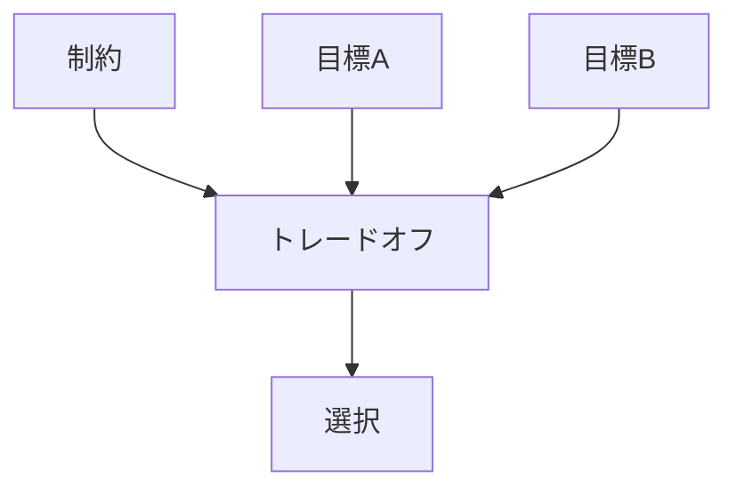
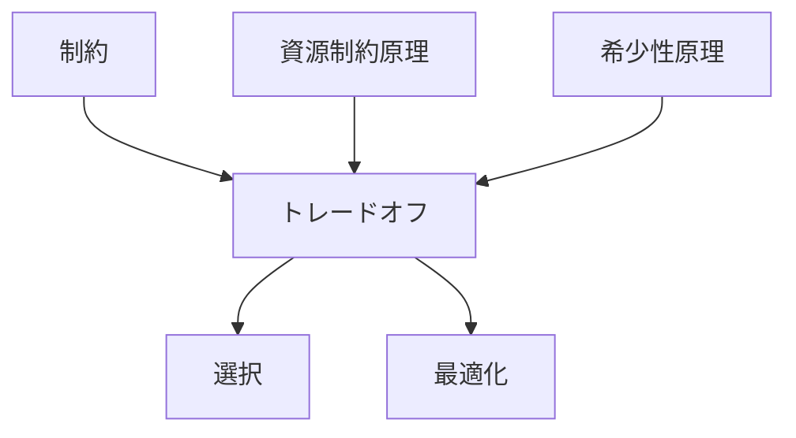

# トレードオフ

## 定義

ある価値・目的・資源を増やすと、  
別の価値・目的・資源を減らさなければならない

**代償関係**

を **トレードオフ** という。

簡単に言えば、

**全部は取れない**  
という原理である。

---

## 要点

トレードオフの本質は

- 制約がある
- 複数の望ましい目標がある
- それらを同時には最大化できない

という点にある。

したがってトレードオフは  
意思決定の周辺概念ではなく、

**意思決定そのものの中心条件**

である。

---

# 基本構造



---

# トレードオフの本質

## 1 すべては最大化できない

例

- 速さと安全
- 品質とコスト
- 自由と統制
- 成長と安定

これらはしばしば両立せず、  
どこかで配分や妥協が必要になる。

---

## 2 選択には代償がある

何かを選ぶことは、  
別の可能性を捨てることでもある。

これが

**機会費用**

である。

---

## 3 制約がトレードオフを生む

もし制約がなければ  
すべてを同時に達成できるかもしれない。

しかし現実には

- 時間が足りない
- 資金が足りない
- 注意が足りない
- 能力が足りない

ため、トレードオフが発生する。

---

# kernelとの関係



---

# 制約との関係

制約は  
「全部できない」条件である。

トレードオフは  
その結果として現れる

「何かを取れば何かを失う」構造である。

```text
制約
↓
トレードオフ
↓
選択
```

---

# 資源制約原理との関係

資源が有限であると

- 全部に配れない
- どこかを削る必要がある
- 優先順位が必要になる

そのため資源制約は  
トレードオフの主要原因である。

---

# トレードオフと最適化

最適化とは

**トレードオフの中で最もましな点を探すこと**

である。

したがって最適化は  
万能解の探索ではなく、

**代償付きの改善**

である。

---

# 各領域での例

## 経済

- 品質と価格
- 在庫と機会損失
- 成長投資と利益確保

---

## 組織

- 分権と統制
- 速度と承認
- 柔軟性と標準化

---

## 生物

- 成長と生存
- 繁殖と寿命
- 免疫とエネルギー消費

---

## 技術

- 精度と速度
- 安全性と利便性
- 拡張性と単純性

---

## 都市・交通

- 回遊性と安全分離
- 高密度利用と居住快適性
- 速達性と停留所密度

---

# mechanism

トレードオフと接続しやすいメカニズム

- 最適化
- 優先順位決定
- 機会費用評価
- 資源配分
- ボトルネック調整

---

# pattern

トレードオフから現れやすいパターン

- 局所最適化
- 過剰最適化
- しわ寄せ
- 二律背反
- 優先順位固定

---

# case

- 低価格戦略による品質低下
- 高速輸送と停車密度の両立困難
- 成長投資で利益率が下がる企業
- セキュリティ強化でUXが悪化するサービス

---

# 見分けるための問い

- 何と何が両立しにくいのか
- 何を増やすと何が減るのか
- この意思決定の代償は何か
- 捨てている価値は何か
- どの制約がこのトレードオフを生んでいるか

---

# 要約

トレードオフとは、

**制約の下で、複数の望ましい目標を同時には最大化できないために生じる代償関係**

である。

したがって意思決定とは  
最善を選ぶことというより、

**どの代償を引き受けるかを決めること**

である。