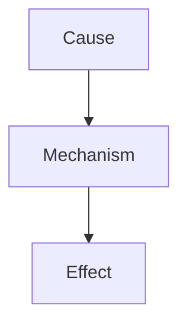
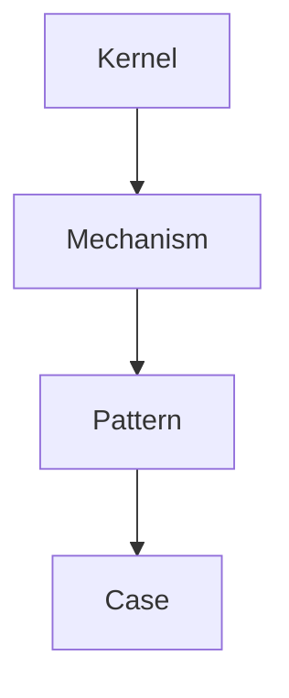
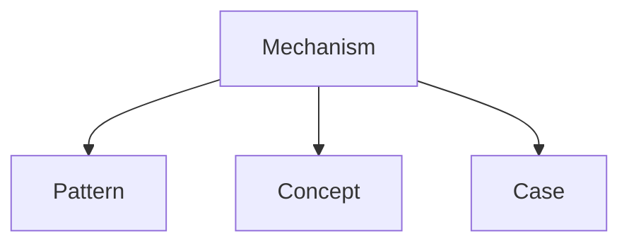

# Mechanism Hub

Mechanism Hub は  
Vault 内の **Mechanism ノートを整理する中心ノード**である。

Mechanism は

```
なぜ起きるか
```

を説明する **因果構造**であり、  
Vault の推論の中心になる。

---

# Mechanism Role

Knowledge Graph における位置。

```
Kernel
↓
Mechanism
↓
Pattern
↓
Case
```

Mechanism は

```
原理 → 現象
```

を接続する。

---

# Mechanism Structure



Mechanismは

```
原因
↓
作用
↓
結果
```

の構造を持つ。

---

# Mechanism in Knowledge Graph



Mechanismは

```
Pattern生成
Case説明
```

を担う。

---

# Mechanism Types

Vaultでは Mechanism を次のタイプに分類する。

| Type | 内容 |
|-----|-----|
|Information | 情報作用 |
|Coordination | 協調 |
|Competition | 競争 |
|Learning | 学習 |
|Power | 権力 |
|Social | 社会影響 |

---

# Information Mechanisms

```
Information Diffusion
Information Asymmetry
Signaling
```

---

# Coordination Mechanisms

```
Coordination
Trust Formation
Norm Formation
```

---

# Competition Mechanisms

```
Competition
Free Rider
Conflict
```

---

# Learning Mechanisms

```
Learning
Habit Formation
Reinforcement
```

---

# Social Influence Mechanisms

```
Social Proof
Authority Influence
Conformity
```

---

# Mechanism Discovery

Mechanismは次の方法で発見される。

```
Case
↓
Pattern
↓
Mechanism Identification
```

---

# Mechanism Promotion

Patternが因果説明できる場合

```
Pattern → Mechanism
```

に昇格する。

関連ノート

- [[Pattern to Mechanism Promotion]]

---

# Mechanism and Reasoning

LLMの推論では

```
Mechanism中心探索
```

が行われる。

---

# Graph Traversal

LLMは Mechanism を中心に Knowledge Graph を探索する。



---

# Mechanism Importance

Vaultの推論では

```
Mechanism > Pattern > Case
```

の順で重要。

---

# Related Notes

- [[Pattern Extraction Method 1]]
- [[Mechanism Identification Method]]
- [[Pattern to Mechanism Promotion]]
- [[02_zettelkasten/00_hub/Vault Knowledge Graph Architecture]]
- [[Graph Traversal Rule]]