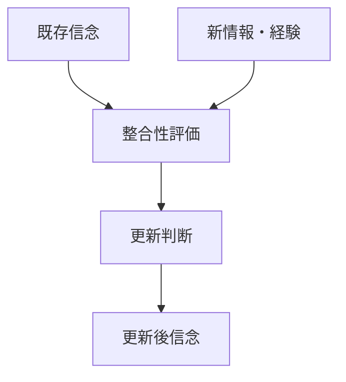
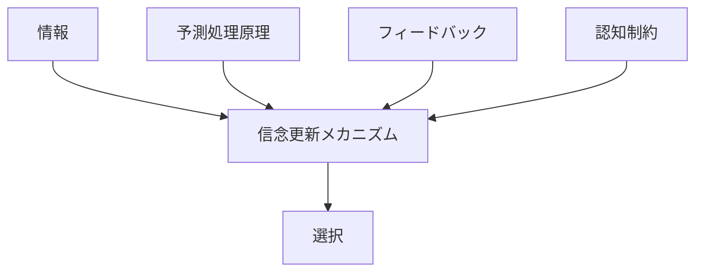

# 信念更新メカニズム

## 定義

主体が新しい情報・経験・観測結果を受け取り、  
既存の信念・期待・世界理解を

**修正・維持・強化・棄却する過程**

を **信念更新メカニズム** という。

---

# 基本構造



つまり

```text
既存信念
+
新情報
↓
評価
↓
更新
```

である。

---

# 信念更新の本質

## 1 信念は固定ではない

信念は一度持ったら終わりではなく、  
新しい観測や経験によって常に見直されうる。

---

## 2 すべての情報で更新するわけではない

主体は受け取った情報をそのまま信じるのではなく、

- 信頼できるか
- 既存信念と整合するか
- コストに見合うか

を評価する。

---

## 3 更新には方向がある

信念更新の結果は必ずしも「修正」だけではない。

- 強化
- 微修正
- 保留
- 棄却
- 反転

がある。

---

# 基本パターン

## 強化

新情報が既存信念を支持する。

```text
既存信念
+
整合的情報
↓
確信強化
```

---

## 修正

新情報を受けて信念の一部を変える。

```text
既存信念
+
部分的不一致
↓
局所修正
```

---

## 反転

既存信念を維持できなくなる。

```text
既存信念
+
決定的反証
↓
信念転換
```

---

## 保留

情報が不足し、判断を更新しない。

```text
不十分情報
↓
更新停止
```

---

# 何によって更新が左右されるか

## 情報の信頼性

情報源が信頼できるほど更新しやすい。

例

- 専門家
- 実測値
- 一次資料

---

## 既存信念の強さ

長く維持されてきた信念や  
自己同一性と結びついた信念ほど変わりにくい。

---

## 反証の強さ

小さな不一致では更新されないことが多いが、  
累積的または決定的な証拠は更新を促す。

---

## 更新コスト

信念を変えると

- 社会関係
- 自己像
- 行動方針

まで変わることがある。

このコストが高いほど更新は起こりにくい。

---

# kernelとの関係



---

# 情報との関係

信念更新は  
新しい情報を受け取ることから始まる。

ただし情報はそのまま更新を起こすのではなく、  
既存信念との比較を通じて意味を持つ。

---

# フィードバックとの関係

行動の結果が予想と違ったとき、  
その差分がフィードバックとして働き、  
信念更新を促す。

例

- 売れると思った商品が売れなかった
- 安全だと思った経路で事故が起きた

---

# 予測処理原理との関係

主体は世界をただ受け取るのではなく、  
あらかじめ予測している。

信念更新は

```text
予測
↓
観測
↓
誤差
↓
修正
```

の流れで起きる。

---

# 認知制約との関係

現実の主体は

- 全情報を見られない
- 正確に比較できない
- 感情や先入観に左右される

ため、信念更新は常に制約付きである。

---

# 各領域での例

## 個人認知

- 誤解の修正
- ニュースを見ての意見変化
- 失敗経験による学習

---

## 生物・学習

- 強化学習
- 環境反応の更新

---

## 経済

- 市場予想の修正
- 需要見通しの更新
- 投資判断の見直し

---

## 組織

- KPIを見て戦略変更
- 顧客の声で方針修正
- 現場報告で計画を改訂

---

## 科学

- 新証拠による仮説修正
- 反証による理論更新

---

# mechanism

信念更新メカニズムと接続しやすいメカニズム

- 情報更新メカニズム
- フィードバック制御メカニズム
- 学習メカニズム
- シグナリングメカニズム
- ナラティブ形成メカニズム

---

# pattern

信念更新から現れやすいパターン

- 漸進的学習
- 認知固定
- 確証強化
- 態度反転
- 過剰反応
- 保守的更新

---

# case

- 価格予想の修正
- テスト結果による学習方針変更
- 現場クレームによる業務改善
- 研究仮説の修正
- 投資家の市場見通し変更

---

# 見分けるための問い

- もとの信念は何か
- 新たに入った情報は何か
- その情報は信頼できるか
- 更新は強化・修正・反転のどれか
- 更新を妨げている要因は何か
- 更新後に行動はどう変わるか

---

# 要約

信念更新メカニズムとは、

**新しい情報や経験を受けて、既存の信念や期待を修正・維持・強化・棄却する過程**

である。

したがって主体の判断を理解するには、  
今何を信じているかだけでなく、

**どの情報で、どの条件のもとで、その信念がどう更新されるか**

を見る必要がある。