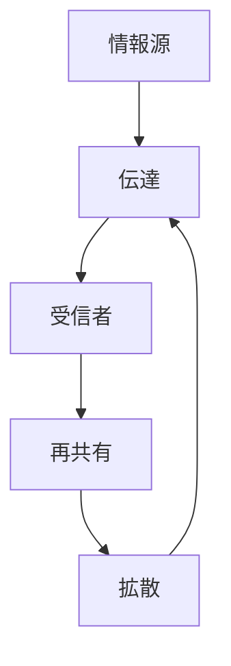
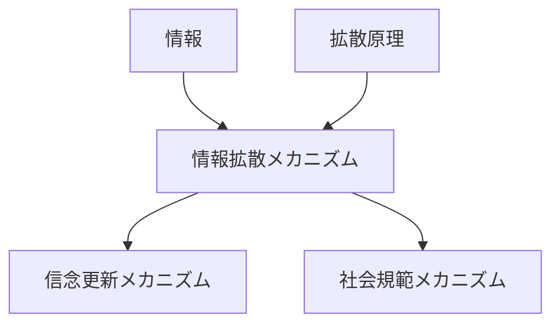

# 情報拡散メカニズム

## 定義

情報が

- 人
- 組織
- ネットワーク
- メディア

を通じて次々に伝達され、  
**社会全体に広がっていく過程**

を **情報拡散メカニズム** という。

---

# 基本構造



つまり

```text
情報源
↓
伝達
↓
受信
↓
再共有
↓
拡散
```

という連鎖である。

---

# 情報拡散の特徴

## 1 ネットワーク構造に依存する

情報は

```
人と人のつながり
```

を通じて拡散する。

重要な要素

- ハブ
- コミュニティ
- 橋渡しノード

---

## 2 再共有によって増幅する

一人が情報を受け取るだけでは拡散しない。

重要なのは

```
再共有
```

である。

---

## 3 内容によって拡散速度が変わる

拡散しやすい情報

- 感情的
- 新奇性がある
- 社会的に重要
- 身近

---

# kernelとの関係



---

# 拡散原理との関係

拡散原理は

```
密度差
↓
拡散
```

という一般原理である。

情報拡散メカニズムは

```
社会ネットワーク
```

を通じた拡散の具体形である。

---

# シグナリングとの関係

情報はしばしば

```
自分を示すシグナル
```

として共有される。

例

- 知識アピール
- 立場表明
- 共感表現

---

# 評判との関係

情報拡散は

```
評判
```

を形成する。

例

- レビュー
- 噂
- SNS評価

---

# 信念更新との関係

拡散された情報は

```
信念
```

を更新する可能性がある。

ただし

- 誤情報
- 偏った情報

も拡散する。

---

# 社会規範との関係

規範もまた

```
情報
```

として拡散する。

例

- マナー
- 文化
- 道徳

---

# 情報拡散のパターン

## 連鎖拡散

一人から順番に広がる。

---

## ハブ拡散

影響力の大きいノードから急速に広がる。

---

## コミュニティ拡散

同じ集団内で強く広がる。

---

## バイラル拡散

爆発的に拡散する。

---

# 各領域での例

## 社会

- 噂
- 流行
- 世論

---

## メディア

- ニュース
- SNSトレンド
- バイラルコンテンツ

---

## 組織

- 社内情報共有
- 知識伝播

---

## 市場

- 商品口コミ
- ブランド評判

---

# pattern

情報拡散メカニズムから現れやすいパターン

- バイラル拡散
- エコーチェンバー
- 情報カスケード
- 群集行動

---

# case

- SNSトレンド
- 噂の拡散
- 商品口コミ
- ミーム

---

# 見分けるための問い

- 情報源はどこか
- 誰が拡散しているか
- どのネットワークを通っているか
- なぜ共有されたのか
- 拡散速度はどのくらいか

---

# 要約

情報拡散メカニズムとは

**情報がネットワークを通じて再共有されながら広がり、社会認知や行動に影響を与える仕組み**

であり、

```text
情報源
↓
伝達
↓
再共有
↓
拡散
```

という過程によって  
世論、評判、流行などが形成される。