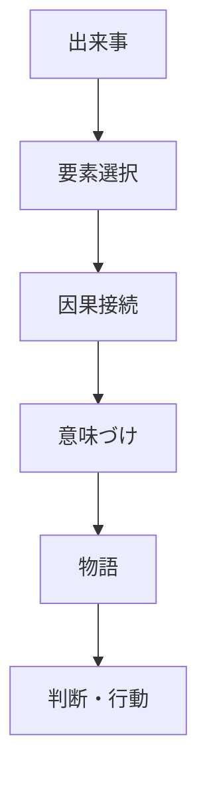
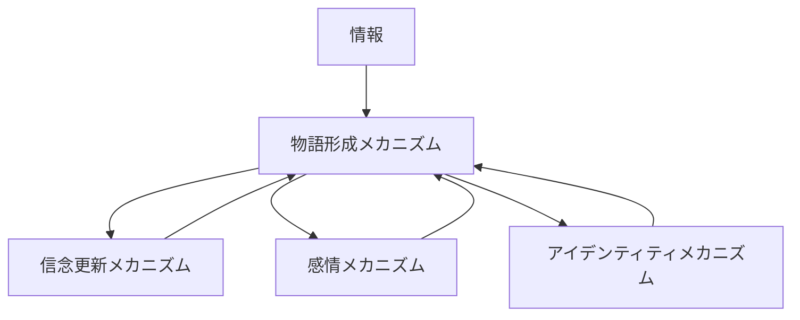

# 物語形成メカニズム

## 定義

主体が出来事・情報・行為・結果を

- 時系列
- 因果
- 意味
- 価値判断

によって結びつけ、

**理解可能で共有可能なストーリーとして再構成する仕組み**

を **物語形成メカニズム** という。

---

# 基本構造



つまり

```text
出来事
↓
選択
↓
因果化
↓
意味づけ
↓
物語
↓
判断・行動
```

である。

---

# 物語形成の本質

## 1 ばらばらの出来事をつなぐ

現実の出来事は断片的で雑多である。

物語形成はそれらを

- 何が起きたか
- なぜ起きたか
- 誰がどうしたか
- それが何を意味するか

という形に並べ直す。

---

## 2 因果と意味を与える

物語は単なる時系列ではない。

重要なのは

```text
Aが起きた
↓
だからBが起きた
↓
つまりこれはXを意味する
```

という因果と意味の付与である。

---

## 3 記憶しやすく共有しやすくする

人は断片的データより

```text
筋のある話
```

の方を覚えやすい。

そのため物語は

- 記憶圧縮
- 他者共有
- 集団統合

に役立つ。

---

## 4 行動を方向づける

人は現実そのものではなく、  
しばしば

```text
自分がどう解釈したか
```

に基づいて行動する。

そのため物語形成は

- 判断
- 忠誠
- 怒り
- 協力
- 対立

を生み出す。

---

# kernelとの関係



---

# 情報との関係

物語形成は  
断片的な情報をそのまま保持するのではなく、

**意味のある構造に変換する**

仕組みである。

同じ情報でも  
どう並べ、どこを強調し、何を省くかで  
まったく異なる物語になる。

---

# 信念更新との関係

新しい情報は直接信念を変えるだけでなく、

```text
既存の物語
```

に組み込まれて解釈される。

そのため物語は

- 信念更新を助ける
- 逆に更新を妨げる

両方の働きを持つ。

---

# 感情との関係

感情は物語形成を強く方向づける。

例

- 怒り → 加害者物語
- 恐怖 → 危機物語
- 誇り → 栄光物語
- 悲しみ → 喪失物語

逆に物語は感情を増幅する。

---

# アイデンティティとの関係

主体は

```text
自分は何者か
```

という自己像に合う物語を作りやすい。

集団もまた

- 我々は被害者だ
- 我々は先駆者だ
- 我々は正しい側だ

といった物語で自己理解を固定する。

---

# 社会規範との関係

物語は

```text
何が善で何が悪か
```

を示すことで規範を支える。

例

- 努力は報われる
- 裏切りは罰される
- 忠誠は尊い

---

# シグナリングとの関係

物語は自己提示の道具にもなる。

主体は自分について

```text
どんな物語を語るか
```

によって、

- 信頼
- 能力
- 誠実性
- 被害者性
- 正当性

を示そうとする。

---

# 物語形成の主要パターン

## 因果物語

「なぜ起きたか」を説明する。

---

## 正当化物語

自分や集団の行動を正当化する。

---

## 被害物語

被害経験を中心に世界を理解する。

---

## 成長物語

失敗や困難を成長の一部として再構成する。

---

## 敵対物語

敵と味方を分け、対立を強化する。

---

# 各領域での例

## 個人

- 失敗経験の意味づけ
- キャリアの自己物語
- 恋愛や挫折の再解釈

---

## 組織

- 創業物語
- 危機克服物語
- ミッション共有

---

## 社会

- 国家神話
- 歴史認識
- 世代物語

---

## 市場・ブランド

- ブランドストーリー
- 顧客体験談
- プロダクト神話

---

## 政治

- 改革物語
- 危機物語
- 敵味方物語

---

# pattern

物語形成メカニズムから現れやすいパターン

- 英雄化
- スケープゴート化
- 陰謀論化
- 成長物語化
- 被害者物語化
- 正当化物語化

---

# case

- 創業者神話
- 国家の建国神話
- SNS炎上の加害者物語
- 自己啓発的成長物語
- 政治運動の危機物語

---

# 見分けるための問い

- どの出来事が選ばれているか
- 何が省略されているか
- どんな因果でつながれているか
- その物語は誰に有利か
- どんな感情を動員しているか
- どのアイデンティティを支えているか

---

# 要約

物語形成メカニズムとは

**出来事や情報を因果と意味によって結びつけ、理解可能で共有可能なストーリーに変換する仕組み**

である。

したがって人間や集団の行動を理解するには、  
事実の列挙だけでなく、

```text
その事実がどんな物語として編成されているか
```

を見る必要がある。