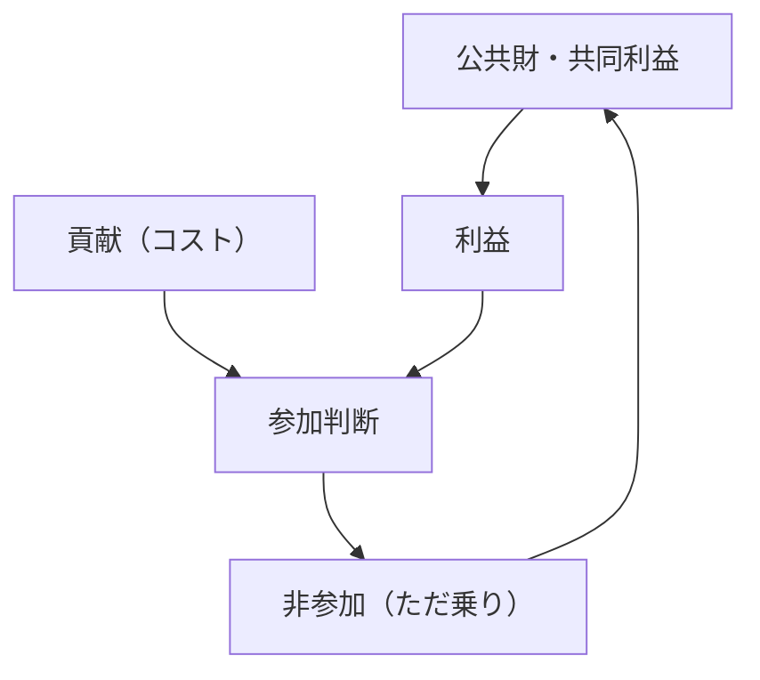
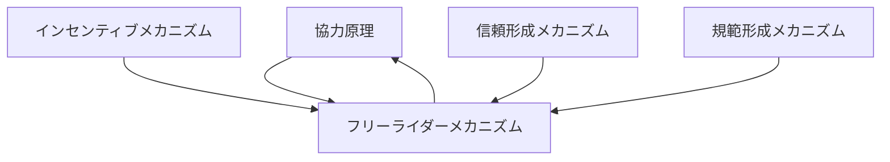

# フリーライダーメカニズム

## 定義

公共財や集団的利益が存在する状況で、

- 自分はコストを負担せず
- 他者の貢献による利益だけを享受する

という行動が合理的選択として発生する仕組みを  
**フリーライダーメカニズム（Free Rider Mechanism）**という。

---

# 基本構造



つまり

```text
共同利益
↓
個人コスト
↓
参加判断
↓
非参加（ただ乗り）
```

である。

---

# 本質

フリーライダーは

```
個人合理性
```

と

```
集団合理性
```

のズレから生じる。

---

# なぜ起こるか

## 1 非排除性

公共財は

```
払わなくても利用できる
```

例

- 安全
- 公園
- インフラ

---

## 2 非競合性

一人増えてもコストが増えない。

---

## 3 個人インセンティブ

個人にとっては

```
払わない方が得
```

---

## 4 他者依存

「誰かがやるだろう」という期待。

---

# kernelとの関係



---

# 協力原理との関係

フリーライダーは

```
協力を破壊する力
```

である。

---

# インセンティブとの関係

フリーライダーは

```
インセンティブ構造の結果
```

である。

---

# 信頼との関係

信頼が低いと

```
他人も払わないだろう
```

と考え、フリーライダーが増える。

---

# 規範との関係

規範が強いと

```
ただ乗りは悪
```

とされ、抑制される。

---

# フリーライダー問題

集団全体では

```
全員が協力した方が良い
```

が、

個人では

```
協力しない方が得
```

となる状況。

---

# 解決メカニズム

## 1 制裁

違反者にコストを与える。

---

## 2 排除

貢献しない者を除外。

---

## 3 選択的インセンティブ

参加者だけに利益。

---

## 4 規範

道徳や文化による抑制。

---

## 5 小集団化

監視と相互認識を強化。

---

# 各領域での例

## 社会

- 税逃れ
- 公共マナー違反

---

## 組織

- チームでのサボり
- 責任回避

---

## 市場

- 無賃乗車
- 海賊版

---

## デジタル

- 無料サービス利用
- コンテンツただ乗り

---

# pattern

フリーライダーメカニズムから現れるパターン

- 協力崩壊
- 負担偏在
- 公共財不足
- 監視強化

---

# case

- 税回避
- 無賃乗車
- チーム内不貢献
- 無料サービス利用

---

# 見分けるための問い

- 利益は共有されているか
- 貢献しないと何が起こるか
- 誰がコストを負担しているか
- 非参加者は排除されるか
- 制裁や規範はあるか

---

# 要約

フリーライダーメカニズムとは

**公共財や集団利益が存在する状況で、個人がコストを回避して利益のみを享受しようとする合理的行動が発生する仕組み**

であり、

```text
共同利益
↓
個人コスト
↓
参加判断
↓
非参加
```

という構造を通じて  
協力の不安定性を生み出す。