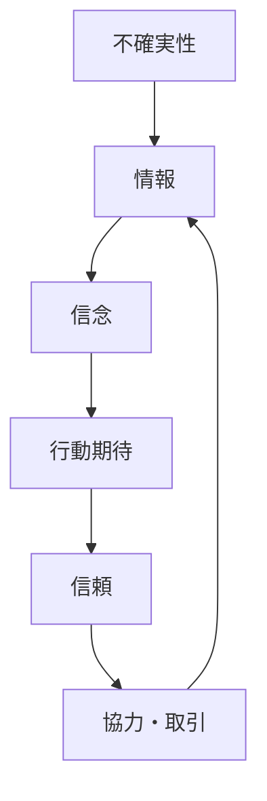
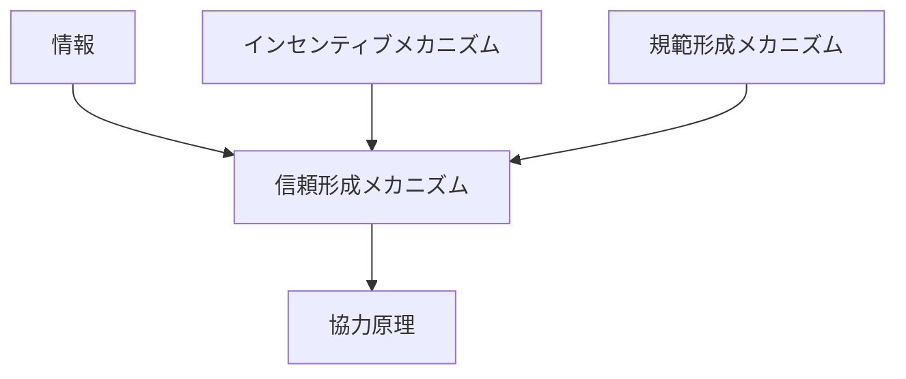

# 信頼形成メカニズム

## 定義

主体が

- 他者は裏切らない
- 約束を守る
- 協力する

と期待し、**不確実性の中で相手に依存した行動を選択する状態が形成される仕組み**を  
**信頼形成メカニズム** という。

---

# 基本構造



つまり

```text
不確実性
↓
情報
↓
信念
↓
期待
↓
信頼
↓
協力
```

という循環である。

---

# 信頼とは何か

信頼とは

```
裏切られるリスクを受け入れて行動すること
```

である。

完全情報下では信頼は不要であり、  
不確実性があるときにのみ成立する。

---

# 信頼形成の要因

## 1 過去の経験

繰り返しの相互作用により

```
裏切らなかった履歴
```

が蓄積される。

---

## 2 評判

第三者情報によって

```
直接経験なしに信頼
```

が形成される。

---

## 3 シグナル

主体は

```
信頼できることを示す行動
```

をとる。

例

- 保証
- コストのかかる行動
- 認証

---

## 4 制度

ルールや契約があることで

```
裏切りコスト
```

が上がる。

---

## 5 規範

社会的に

```
裏切りは悪
```

という価値が共有される。

---

# kernelとの関係



---

# 情報との関係

信頼は

```
情報不足を補う仕組み
```

である。

---

# インセンティブとの関係

信頼が成立するには

```
裏切るより守る方が得
```

である必要がある。

---

# 規範との関係

規範が強いほど

```
裏切りの心理コスト
```

が高くなる。

---

# 協力原理との関係

信頼は

```
協力の前提条件
```

である。

---

# 信頼の種類

## 個人的信頼

特定の相手への信頼。

---

## 一般的信頼

見知らぬ他者への信頼。

---

## 制度的信頼

制度や組織への信頼。

---

# 信頼の崩壊

信頼は

```
裏切り
```

によって急速に崩れる。

再構築は困難で時間がかかる。

---

# 各領域での例

## 市場

- 商取引
- ブランド信頼

---

## 社会

- 人間関係
- コミュニティ

---

## 組織

- 上司と部下
- チーム協力

---

## デジタル

- プラットフォーム信頼
- オンライン取引

---

# pattern

信頼形成メカニズムから現れるパターン

- 信頼ネットワーク
- 長期協力
- 裏切り崩壊
- 信頼回復困難

---

# case

- 長期取引関係
- ブランド信用
- SNS評価
- 地域コミュニティ

---

# 見分けるための問い

- なぜこの主体は相手を信頼しているのか
- 情報はどこから来ているか
- 裏切りコストは何か
- 評判や制度はどう関与しているか
- 信頼はどの程度強いか

---

# 要約

信頼形成メカニズムとは

**不確実性の中で、情報・経験・評判・制度・規範に基づいて相手の行動を予測し、リスクを取って協力・取引を行う状態が形成される仕組み**

であり、

```text
情報
↓
信念
↓
期待
↓
信頼
↓
協力
```

というプロセスを通じて  
社会的相互作用を成立させる。