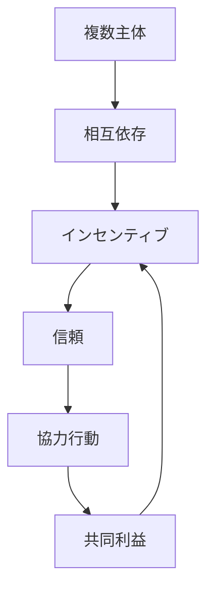
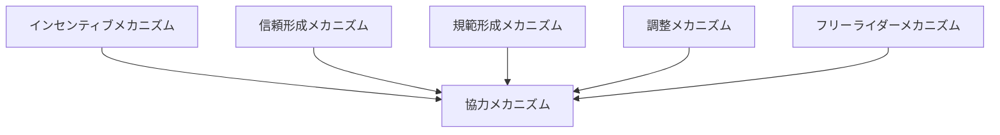

# 協力メカニズム

## 定義

複数の主体が

- 自己利益を持ちながらも
- 他者と協調して行動し
- 単独では得られない成果を生み出す

ようになる仕組みを  
**協力メカニズム** という。

---

# 基本構造



つまり

```text
相互依存
↓
インセンティブ
↓
信頼
↓
協力
↓
共同利益
```

である。

---

# 協力の本質

## 1 単独よりも共同の方が得

協力は

```
協力した方が利益が大きい
```

ときに成立する。

---

## 2 しかし裏切りの誘惑がある

協力関係には常に

```
裏切ればより得をする可能性
```

が存在する。

そのため協力は不安定になりやすい。

---

## 3 協力は条件付きで成立する

協力は

- 信頼
- 制度
- 規範
- インセンティブ

によって支えられる。

---

# 協力成立の条件

## 1 相互依存

一人では成果が出ない。

---

## 2 将来関係

関係が繰り返されると

```
裏切りコスト
```

が高くなる。

---

## 3 情報

相手の行動が観察できる。

---

## 4 制裁

裏切りに対するペナルティがある。

---

## 5 規範

協力が「正しい」とされる。

---

# kernelとの関係



---

# インセンティブとの関係

協力は

```
協力した方が得になる構造
```

によって成立する。

---

# 信頼との関係

信頼がなければ

```
裏切られるリスク
```

が大きく、協力は成立しにくい。

---

# 規範との関係

規範は

```
協力しないことの心理コスト
```

を上げる。

---

# 調整との関係

協力しても

```
どう分担するか
```

が決まらなければ成果は出ない。

---

# フリーライダーとの関係

フリーライダーは

```
協力の最大の障害
```

である。

---

# 協力の主要タイプ

## 直接協力

当事者同士で行う。

---

## 間接協力

第三者を介する。

---

## 制度的協力

ルールや契約で支えられる。

---

## 規範的協力

文化や価値観による。

---

# 協力の安定化メカニズム

## 繰り返し

長期関係により裏切りが不利になる。

---

## 評判

裏切ると将来不利になる。

---

## 制裁

違反にコストを与える。

---

## 排除

裏切り者を除外する。

---

# 協力崩壊の条件

- 信頼がない
- 情報が不足
- インセンティブが逆転
- フリーライダーが多い
- 制裁が弱い

---

# 各領域での例

## 社会

- 相互扶助
- 地域協力

---

## 組織

- チームワーク
- プロジェクト

---

## 市場

- 契約取引
- 企業間連携

---

## デジタル

- OSS開発
- コミュニティ運営

---

# pattern

協力メカニズムから現れるパターン

- 相互扶助
- 長期関係
- 協力崩壊
- 信頼ネットワーク

---

# case

- チームプロジェクト
- 共同事業
- 地域自治
- OSS開発

---

# 見分けるための問い

- なぜ主体は協力しているのか
- 裏切るとどうなるか
- 信頼はどのように形成されているか
- インセンティブはどう設計されているか
- フリーライダーは存在するか

---

# 要約

協力メカニズムとは

**相互依存の中で、信頼・インセンティブ・規範・制度によって裏切りの誘惑を抑え、複数主体が協調行動をとるようになる仕組み**

であり、

```text
相互依存
↓
信頼・インセンティブ
↓
協力
↓
共同利益
```

という構造によって  
社会・市場・組織の基盤を形成する。