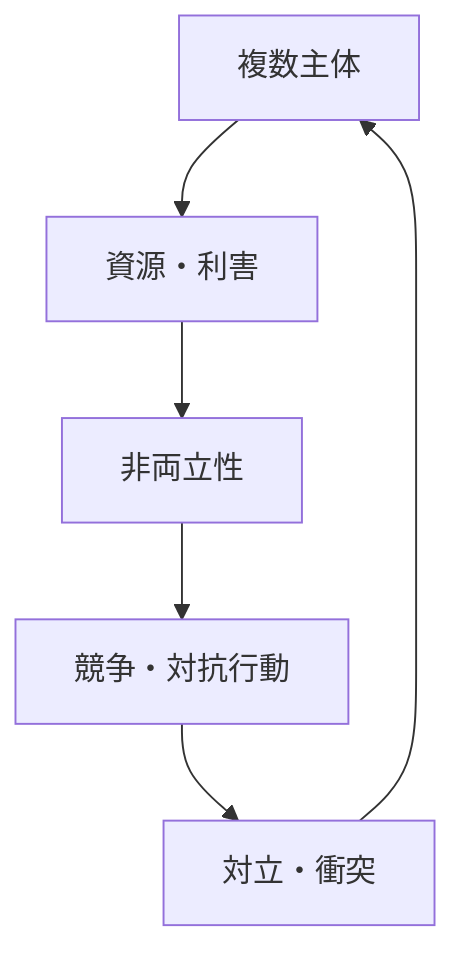
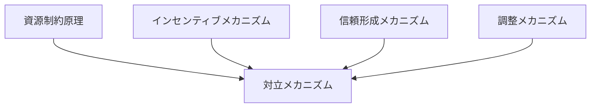

# 対立メカニズム

## 定義

複数の主体の間で

- 利害
- 資源
- 価値観
- 権力

が一致せず、**互いに相手の行動を制約・排除・打倒しようとする相互作用が生まれる仕組み**を  
**対立メカニズム**という。

---

# 基本構造



つまり

```text
資源・利害
↓
非両立
↓
競争
↓
対立
```

である。

---

# 対立の本質

## 1 利害の非両立

対立は

```
同時に満たせない要求
```

があるときに発生する。

---

## 2 相互依存の中で発生

完全に独立していれば対立は起きない。

相互に影響し合うからこそ対立が生まれる。

---

## 3 相手行動への干渉

対立では

```
自分の利益最大化
```

が

```
相手の行動制約
```

を伴う。

---

# 対立が生まれる原因

## 1 資源制約

資源が有限である。

例

- 土地
- 予算
- 時間
- ポジション

---

## 2 インセンティブ衝突

個人合理性が集団合理性と一致しない。

---

## 3 情報非対称

誤解や不信が対立を強める。

---

## 4 信頼欠如

相手が協力しないと予想する。

---

## 5 規範の違い

価値観の違い。

---

# kernelとの関係



---

# 資源制約との関係

資源が有限である限り

```
取り合い
```

が発生する。

---

# インセンティブとの関係

対立は

```
合理的行動の結果
```

として生まれることが多い。

---

# 信頼との関係

信頼が低いと

```
先に攻撃した方が得
```

となり対立が激化する。

---

# 調整との関係

調整が成功すれば対立は

```
協力
```

に転換される。

---

# 対立の類型

## 利益対立

経済的利益の衝突。

---

## 権力対立

支配・意思決定の争い。

---

## 価値対立

価値観・理念の衝突。

---

## 認識対立

情報や解釈の違い。

---

# 対立のダイナミクス

## エスカレーション

対立が強化される。

---

## 均衡

対立が安定状態になる。

---

## 解消

調整・制度化によって解消される。

---

## 分離

接触を断つことで解消。

---

# 各領域での例

## 社会

- デモと対抗勢力
- 地域対立

---

## 組織

- 部門間対立
- 権限争い

---

## 市場

- 企業競争
- 価格競争

---

## 国際

- 戦争
- 外交対立

---

# pattern

対立メカニズムから現れるパターン

- エスカレーション
- 分極化
- 報復連鎖
- 対立固定化

---

# case

- 労使対立
- 企業競争
- 政治対立
- 国際紛争

---

# 見分けるための問い

- 何が非両立なのか
- 誰と誰が対立しているのか
- 資源は何か
- 対立はどの程度激化しているか
- 調整や制度化の余地はあるか

---

# 要約

対立メカニズムとは

**資源・利害・価値の非両立により、主体が相互に競争・干渉し、衝突状態に至る仕組み**

であり、

```text
非両立
↓
競争
↓
対立
```

という構造を通じて  
社会・市場・組織における衝突や分断を生み出す。