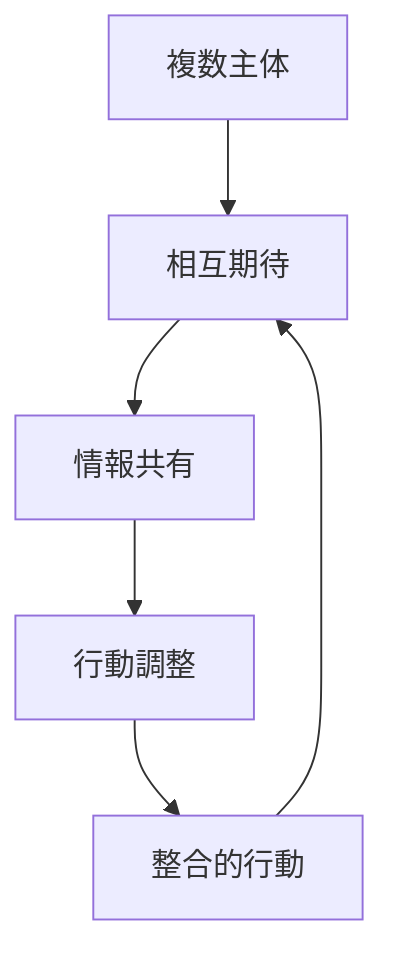
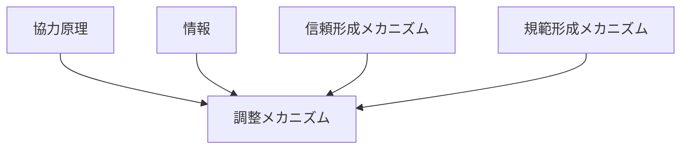

# 調整メカニズム

## 定義

複数の主体が互いの行動をすり合わせ、

- 衝突を減らし
- 役割を分け
- 行動タイミングや方向を合わせて

**全体として整合的に動けるようにする仕組み**

を **調整メカニズム** という。

---

# 基本構造



つまり

```text
相互期待
↓
情報共有
↓
行動調整
↓
整合的行動
```

である。

---

# 調整の本質

## 1 協力とは別の問題である

協力は

```text
一緒にやる意思があるか
```

の問題であり、

調整は

```text
どう噛み合わせるか
```

の問題である。

意思があっても、調整が失敗すれば全体は機能しない。

---

## 2 相互期待の一致が必要

調整には

- 誰が何をするか
- いつやるか
- どの順番か
- どの基準に従うか

に関する期待の一致が必要である。

---

## 3 情報共有が不可欠

相手の状態や意図が見えないと調整は難しい。

そのため調整は

- 合図
- 会議
- 手順
- 標準
- スケジュール

などを必要とする。

---

# 調整が必要になる状況

## 1 相互依存がある

一人の行動が他者の結果に影響する。

例

- チーム作業
- サプライチェーン
- 交通流

---

## 2 同時実行または順序依存がある

例

- 工程管理
- 会議進行
- 信号制御

---

## 3 資源競合がある

同じ資源を複数主体が使うと衝突する。

例

- 会議室
- 道路
- 予算

---

# kernelとの関係



---

# 協力原理との関係

協力は

```text
一緒にやる
```

であり、調整は

```text
どう分担して合わせるか
```

である。

したがって調整メカニズムは  
協力原理の実装部分に近い。

---

# 情報との関係

調整には

- 状態共有
- 予定共有
- 役割共有
- 変化通知

が必要である。

情報不足は調整失敗を招く。

---

# 信頼との関係

信頼があると

```text
相手も自分の役割を果たす
```

と期待できるため、調整コストが下がる。

---

# 規範との関係

規範は調整を簡単にする。

例

- 列に並ぶ
- 左右どちらに寄る
- 発言順を守る

こうした暗黙ルールがあると毎回交渉しなくて済む。

---

# インセンティブとの関係

調整には

```text
自分勝手に動かない方が得
```

というインセンティブが必要なことがある。

例

- 納期順守
- 定時運行
- 手順順守

---

# 調整の主要手段

## 1 価格による調整

市場では価格が調整装置になる。

---

## 2 権限による調整

組織では上位者の指示が調整を担う。

---

## 3 ルールによる調整

標準手順や制度で行動を合わせる。

---

## 4 規範による調整

暗黙の了解や文化が調整を担う。

---

## 5 交渉による調整

当事者同士が直接すり合わせる。

---

# 調整失敗が起きる原因

## 情報不足

互いの状態が見えない。

---

## 期待不一致

前提や基準が異なる。

---

## インセンティブ不整合

全体最適より個人最適が優先される。

---

## 権限不明確

誰が決めるか分からない。

---

## ルール欠如

調整手段がない。

---

# 各領域での例

## 組織

- 部門間連携
- プロジェクト管理
- 会議運営

---

## 社会

- 交通ルール
- 行列形成
- 災害時避難

---

## 経済

- 市場価格
- サプライチェーン
- 取引条件調整

---

## 技術

- 通信プロトコル
- API標準
- 工程同期

---

## 都市・交通

- 信号制御
- ダイヤ調整
- 接続時刻管理

---

# pattern

調整メカニズムから現れやすいパターン

- 役割分担
- 標準化
- ボトルネック集中
- サイロ化
- 調整失敗
- 期待収束

---

# case

- 会議のアジェンダ運営
- 工場の工程管理
- 鉄道ダイヤ接続
- 交通信号制御
- 複数部門プロジェクト

---

# 見分けるための問い

- 誰と誰の行動を合わせる必要があるか
- 何を共有すれば調整できるか
- 調整は価格、権限、ルール、規範のどれで行われているか
- 調整失敗のボトルネックは何か
- 個人最適と全体最適はズレていないか

---

# 要約

調整メカニズムとは

**複数主体の行動をすり合わせ、期待を一致させ、全体として整合的に動けるようにする仕組み**

であり、

```text
相互期待
↓
情報共有
↓
行動調整
↓
整合的行動
```

という過程を通じて  
協力、分業、組織運営、交通、市場などの安定を支える。