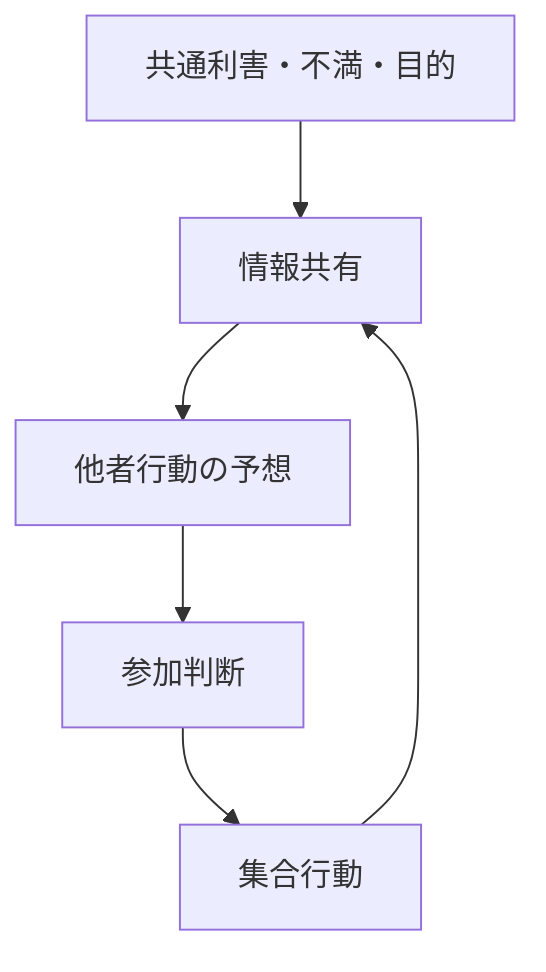
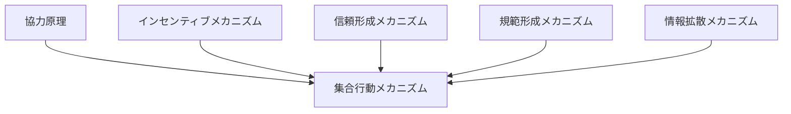

# 集合行動メカニズム

## 定義

多数の主体が

- 共通利益
- 共通目的
- 共通感情
- 共通脅威

に基づいて、**互いの行動を参照しながら同時的・連鎖的に行動する仕組み**を  
**集合行動メカニズム** という。

---

# 基本構造



つまり

```text
共通利害
↓
情報共有
↓
他者参加予想
↓
参加判断
↓
集合行動
```

である。

---

# 集合行動の本質

## 1 個人行動ではなく相互依存行動

集合行動では

```text
自分が動くか
```

が

```text
他人が動くか
```

に依存する。

つまり参加判断は相互依存的である。

---

## 2 共通利益があっても自動では起きない

多くの場合、集合行動には

```text
フリーライダー問題
```

がある。

全員に利益があっても、

- 自分だけはコストを払いたくない
- 他人がやってくれればいい

となりやすい。

---

## 3 閾値を超えると一気に動く

少人数では起きなくても、

- 参加者が見える
- 成功可能性が高まる
- 社会的正当化が進む

と、一気に参加が増えることがある。

---

# 集合行動が成立する条件

## 1 共通利害

参加者が

```text
同じ問題
```

を認識している必要がある。

例

- 不満
- 危機
- 権利要求
- 共同利益

---

## 2 情報共有

他者も同じ認識を持っていることが見える必要がある。

---

## 3 参加期待

人は

```text
自分だけではない
```

と分かると参加しやすい。

---

## 4 組織化または調整装置

集会、SNS、指導者、団体などがあると行動がまとまりやすい。

---

## 5 制裁または報酬

不参加への非難、参加への名誉などが働くことがある。

---

# kernelとの関係



---

# 協力原理との関係

集合行動は  
協力原理の大規模形である。

ただし二者協力よりも

- 調整コスト
- フリーライダー問題
- 情報問題

が大きい。

---

# インセンティブとの関係

主体は参加に際して

- 得られる利益
- 参加コスト
- 不参加コスト
- 成功確率

を比較する。

そのため集合行動は  
インセンティブ構造に強く依存する。

---

# 信頼との関係

他者も行動すると信じられなければ  
自分は参加しにくい。

したがって信頼は  
集合行動の参加閾値を下げる。

---

# 規範との関係

「参加すべき」「黙っていてはいけない」といった規範があると  
行動が起こりやすい。

逆に「出る杭は打たれる」規範が強いと  
集合行動は抑制される。

---

# 情報拡散との関係

集合行動には

- 不満の共有
- 日時場所の共有
- 成功事例の共有
- 参加者数の可視化

が重要である。

このため情報拡散は  
集合行動の主要条件となる。

---

# 集合行動の典型類型

## 抗議型

権力や制度への異議申し立て。

例  
デモ、ストライキ。

---

## 協力型

共同利益のための協力。

例  
共同清掃、募金、自治活動。

---

## 暴発型

強い感情の共有による急激行動。

例  
暴動、パニック。

---

## 動員型

組織や指導者による動員。

例  
政党集会、宗教集会。

---

# 集合行動の失敗条件

- 他者参加が見えない
- 成功可能性が低い
- 参加コストが高い
- 信頼が低い
- 規範的正当化が弱い
- 抑圧コストが高い

---

# 各領域での例

## 社会運動

- デモ
- 労働運動
- 署名活動

---

## 地域社会

- 町内会活動
- 防災協力
- 共同管理

---

## 組織

- 改革運動
- 集団抵抗
- チーム協力

---

## デジタル

- ハッシュタグ運動
- オンライン炎上
- クラウドファンディング

---

# pattern

集合行動メカニズムから現れやすいパターン

- 雪だるま型参加拡大
- フリーライダー
- 閾値連鎖
- 群衆化
- 動員失敗
- 協力崩壊

---

# case

- デモ運動
- ストライキ
- 地域自治活動
- SNSキャンペーン
- クラウドファンディング

---

# 見分けるための問い

- 何が共通利益または共通不満なのか
- 誰が参加しているのか
- 参加判断は何に依存しているのか
- 他者参加は可視化されているか
- フリーライダー問題はどう処理されているか
- 情報共有と信頼は十分か

---

# 要約

集合行動メカニズムとは

**多数の主体が共通利害と相互期待に基づいて、互いの行動を参照しながら参加判断を行い、同時的・連鎖的に行動する仕組み**

である。

したがって集合行動を理解するには、  
単なる不満や目的だけでなく、

```text
情報共有
信頼
規範
インセンティブ
参加閾値
```

の構造を見る必要がある。