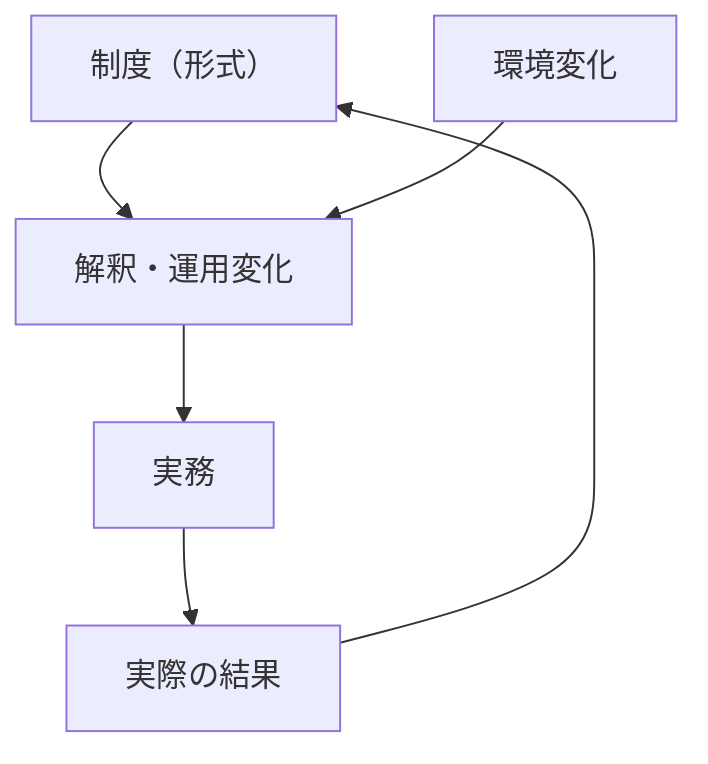
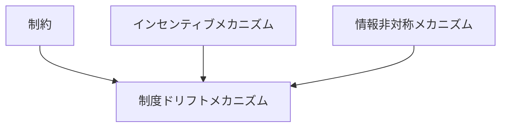

# 制度ドリフトメカニズム

## 定義

制度そのもの（法律・規則・設計）は変わっていないにもかかわらず、

- 解釈
- 運用
- 実務
- 環境

の変化によって、**制度の実際の機能や意味が徐々に変質していく仕組み**を  
**制度ドリフトメカニズム（Institutional Drift）**という。

---

# 基本構造



つまり

```text
制度は固定
↓
環境変化
↓
運用・解釈が変わる
↓
実態が変質
```

である。

---

# 本質

制度ドリフトは

```
制度の変更なしに起こる制度変化
```

である。

---

# なぜ起こるか

## 1 明示的変更の困難

制度変更には

- 政治コスト
- 合意形成
- 法的手続

が必要。

そのため

```
運用で対応
```

が選ばれる。

---

## 2 環境の変化

制度設計時と現在で

```
前提条件が変わる
```

例

- 技術進化
- 市場変化
- 社会構造変化

---

## 3 解釈の柔軟性

制度は多くの場合

```
解釈の余地
```

を持つ。

---

## 4 執行の変化

監視や制裁が弱まると

```
事実上のルール
```

が変わる。

---

# kernelとの関係



---

# インセンティブとの関係

運用者は

```
自分に有利な解釈
```

を選ぶ傾向がある。

---

# 情報非対称との関係

上位者は

```
現場の実態を完全に把握できない
```

ため、ドリフトが進行する。

---

# ルール執行との関係

執行が弱いと

```
実質的ルール
```

が変わる。

---

# 官僚制との関係

官僚制では

- 文書は同じでも
- 実務が変わる

ことでドリフトが起きる。

---

# 制度変化との違い

| 項目 | 制度変化 | 制度ドリフト |
|------|--------|------------|
| 形式 | 変わる | 変わらない |
| 実態 | 変わる | 変わる |
| 可視性 | 高い | 低い |

---

# 典型パターン

## 解釈ドリフト

法律は同じだが解釈が変わる。

---

## 運用ドリフト

実務手順が変わる。

---

## 空洞化

制度は存在するが機能しない。

---

## 代替ルール

非公式ルールが実質支配。

---

# 各領域での例

## 国家

- 憲法解釈の変化
- 行政裁量拡大

---

## 組織

- 社内規則と実務の乖離
- 形骸化した手続

---

## 市場

- 規制の実質無効化
- グレーゾーン運用

---

## デジタル

- 利用規約と実際の運用差

---

# pattern

制度ドリフトメカニズムから現れるパターン

- 形骸化
- 実質支配
- グレーゾーン
- 非公式制度

---

# case

- 憲法解釈変更
- 社内ルールの形骸化
- 規制の骨抜き
- 行政裁量の拡大

---

# 見分けるための問い

- 制度は変わっているか、それとも運用だけか
- 実際の行動はルール通りか
- 誰が解釈を決めているか
- 監視・執行は機能しているか
- 非公式ルールが存在していないか

---

# 要約

制度ドリフトメカニズムとは

**制度の形式を変えずに、解釈や運用の変化によって実質が変わっていく仕組み**

であり、

```text
制度固定
↓
環境変化
↓
運用変化
↓
実態変質
```

という過程を通じて  
見えにくい制度変化を引き起こす。