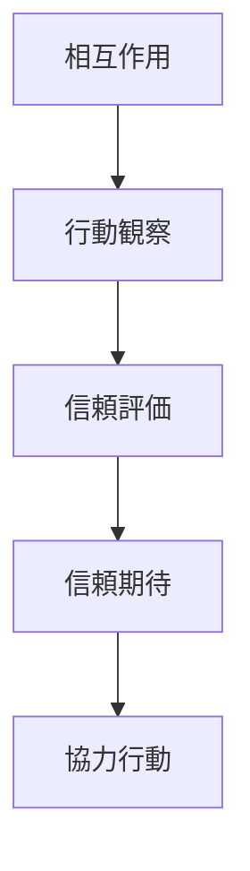
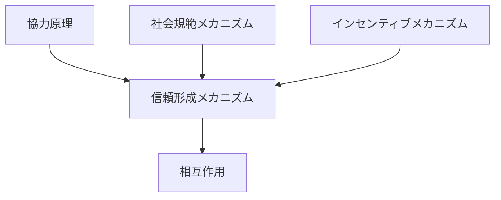

# 信頼形成メカニズム

## 定義

主体が

- 他者
- 組織
- 制度

に対して

**将来の行動が予測可能で裏切られないと期待するようになる過程**

を **信頼形成メカニズム** という。

---

# 基本構造



つまり

```
相互作用
↓
観察
↓
評価
↓
信頼
↓
協力
```

である。

---

# 信頼の機能

## 1 不確実性の削減

信頼があると

```
相手が裏切る可能性
```

を考える必要が減る。

例

- 契約
- チームワーク
- 市場取引

---

## 2 協力の促進

信頼があると

```
協力行動
```

が成立しやすい。

---

## 3 取引コストの削減

信頼が高い社会では

```
監視
契約
制裁
```

のコストが下がる。

---

# 信頼形成の要因

## 1 反復相互作用

相手の行動を繰り返し観察すると  
信頼が形成されやすい。

---

## 2 評判

第三者の情報によって  
信頼が形成される。

---

## 3 規範

社会規範が

```
裏切り
```

を抑制する。

---

## 4 制度

制度が

```
罰則
```

を保証する。

---

# kernelとの関係



---

# 評判との関係

評判は

```
信頼の情報
```

である。

評判があると

```
直接経験
```

がなくても信頼を形成できる。

---

# インセンティブとの関係

裏切りに対する罰があると

```
信頼
```

が成立する。

---

# 社会規範との関係

規範が

```
裏切り
```

を社会的に制裁することで  
信頼が維持される。

---

# 各領域での例

## 個人関係

- 友人関係
- チーム

---

## 組織

- 社内協力
- マネジメント

---

## 経済

- 市場取引
- ブランド信頼

---

## 社会

- 政府信頼
- 法制度信頼

---

# pattern

信頼形成から現れるパターン

- 長期協力
- 信頼ネットワーク
- 社会資本
- 信頼崩壊

---

# case

- 商取引
- オンライン評価システム
- チームプロジェクト
- 地域コミュニティ

---

# 見分けるための問い

- 主体は何を信頼しているか
- 信頼はどの経験から形成されたか
- 信頼はどの制度や規範で支えられているか
- 信頼が崩れる条件は何か

---

# 要約

信頼形成メカニズムとは

**相互作用・観察・評価を通じて他者の行動に対する期待が形成され、協力行動が成立する仕組み**

であり、

```
相互作用
↓
観察
↓
評価
↓
信頼
↓
協力
```

という過程によって  
社会関係や制度の安定を支える。