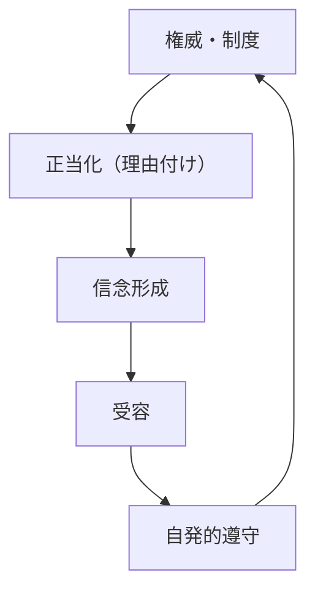
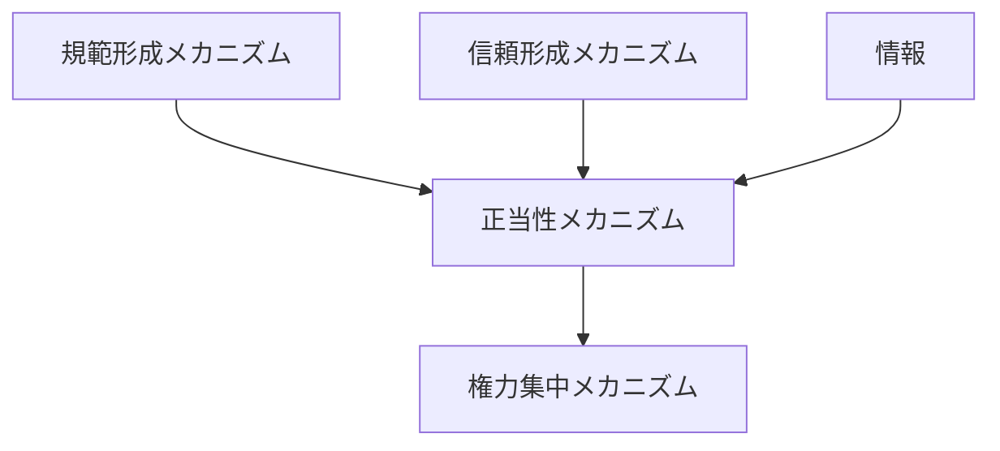

# 正当性メカニズム

## 定義

制度・権力・ルールに対して

- 「正しい」
- 「従うべき」
- 「当然である」

という **正当性の認識（legitimacy）** が形成され、  
強制ではなく自発的な受容・服従が生まれる仕組みを  

**正当性メカニズム** という。

---

# 基本構造



つまり

```text
権威・制度
↓
正当化
↓
信念
↓
受容
↓
自発的遵守
```

という循環である。

---

# 正当性とは何か

正当性とは

```
支配やルールが正しいと信じられている状態
```

である。

強制とは異なり、

```
納得
```

によって従う。

---

# 正当性の三類型（典型）

## 1 伝統的正当性

過去から続いているから正しい。

例

- 王権
- 慣習

---

## 2 カリスマ的正当性

特定の人物の魅力や能力による。

例

- リーダー
- 革命指導者

---

## 3 合法的正当性

ルールや制度に基づく。

例

- 憲法
- 法律
- 手続

---

# kernelとの関係



---

# 規範との関係

正当性は

```
規範の強化版
```

である。

「守るべき」から  
「守るのが当然」へ変わる。

---

# 信頼との関係

信頼があると

```
正当性
```

が成立しやすい。

---

# 情報との関係

正当性は

- 教育
- 宣伝
- 物語
- 歴史

によって形成される。

---

# 権力との関係

権力は

```
正当性
```

を持つことで

- コストをかけずに支配できる
- 反乱を抑えられる

---

# 正当性がない場合

正当性が弱いと

- 強制が必要になる
- 抵抗が増える
- 制度が不安定になる

---

# 正当性の形成プロセス

## 1 理由付け

制度や権力に

```
意味・理由
```

が与えられる。

---

## 2 信念形成

人々がそれを

```
正しいと信じる
```

---

## 3 社会共有

信念が広がる。

---

## 4 内面化

個人の価値観になる。

---

# 正当性の維持

正当性は

```
継続的に更新
```

される必要がある。

例

- 成果
- 公平性
- 説明責任

---

# 正当性の崩壊

以下で崩れる

- 不正
- 不公平
- 失敗
- 情報公開

---

# 各領域での例

## 国家

- 政府の正当性
- 選挙制度

---

## 組織

- 経営の正当性
- 上司の権威

---

## 社会

- 道徳
- 慣習

---

## 市場

- ブランド信頼
- 価格の妥当性

---

# pattern

正当性メカニズムから現れるパターン

- 権威の安定
- 自発的服従
- 制度維持
- 正当性崩壊

---

# case

- 民主主義制度
- 王政
- カリスマ支配
- 企業ブランド

---

# 見分けるための問い

- 人々はなぜそれに従っているのか
- 強制か納得か
- 正当性の根拠は何か
- 正当性は共有されているか
- 正当性は維持されているか

---

# 要約

正当性メカニズムとは

**制度や権力が「正しい」と信じられることで、自発的な受容と遵守が生まれる仕組み**

であり、

```text
正当化
↓
信念
↓
受容
↓
自発的遵守
```

というプロセスを通じて  
強制に依らない支配