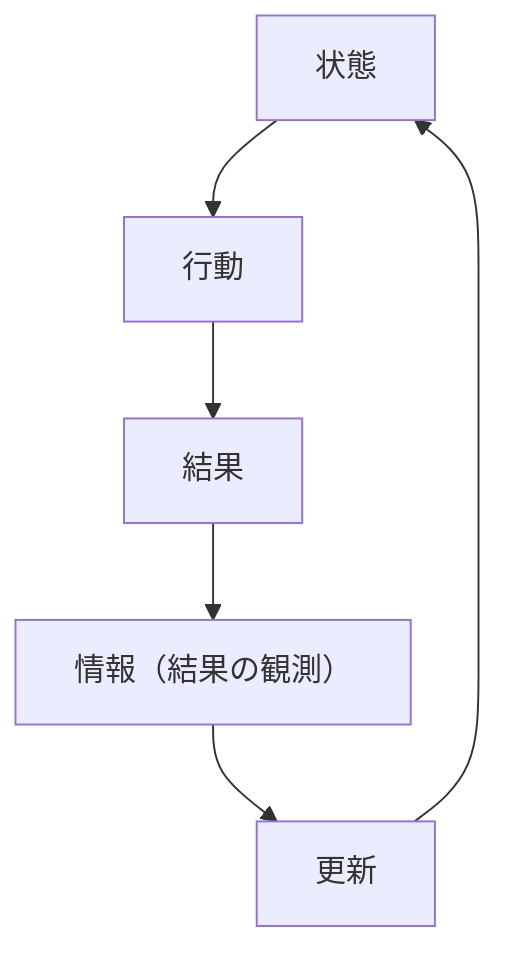
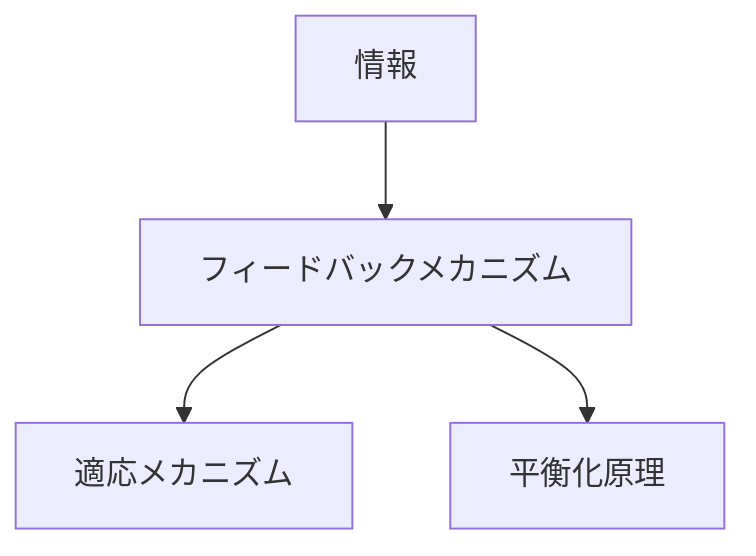

# フィードバックメカニズム

## 定義

主体やシステムの

- 行動
- 出力
- 状態

の結果が、再び入力として戻り、  
**その後の行動や状態に影響を与える循環構造**を  

**フィードバックメカニズム（Feedback Mechanism）**という。

---

# 基本構造



つまり

```text
状態
↓
行動
↓
結果
↓
情報
↓
更新
↓
状態
```

というループである。

---

# フィードバックの本質

## 1 出力が入力に戻る

通常の因果は一方向だが、  
フィードバックは

```
循環
```

する。

---

## 2 システムの自己調整

フィードバックにより

- 修正
- 維持
- 強化

が行われる。

---

## 3 時間的プロセス

フィードバックは

```
時間を通じた変化
```

を生む。

---

# フィードバックの種類

## 正のフィードバック

変化を

```
増幅
```

する。

例

- 流行
- バブル
- 炎上

---

## 負のフィードバック

変化を

```
抑制・安定化
```

する。

例

- 体温調節
- 在庫調整
- 価格調整

---

# kernelとの関係



---

# 情報との関係

フィードバックは

```
結果情報
```

が入力に戻ることで成立する。

---

# 適応との関係

適応は

```
フィードバックに基づく更新
```

である。

---

# 平衡化との関係

負のフィードバックは

```
平衡（安定）
```

を生む。

---

# フィードバックの効果

## 安定化

負のフィードバック。

---

## 増幅

正のフィードバック。

---

## 振動

過剰な調整による揺れ。

---

## 崩壊

暴走による破綻。

---

# フィードバックの条件

## 観測可能性

結果が観測できる。

---

## 反映可能性

行動を変更できる。

---

## 遅延の少なさ

遅延が大きいと不安定になる。

---

## 精度

誤った情報は誤調整を生む。

---

# 各領域での例

## 生物

- ホメオスタシス
- 神経制御

---

## 個人

- 学習
- 習慣形成

---

## 組織

- KPI管理
- PDCA

---

## 市場

- 価格調整
- 需要供給

---

## 社会

- 評判
- 世論

---

# pattern

フィードバックメカニズムから現れるパターン

- 安定化
- 増幅連鎖
- バブル
- 崩壊
- 振動

---

# case

- 在庫管理
- 株価バブル
- SNS炎上
- 体温調節

---

# 見分けるための問い

- 何が入力として戻っているか
- フィードバックは正か負か
- 遅延はあるか
- フィードバックは強すぎないか
- システムは安定しているか

---

# 要約

フィードバックメカニズムとは

**行動や結果が再び入力として戻り、システムの状態や行動を循環的に変化させる仕組み**

であり、

```text
行