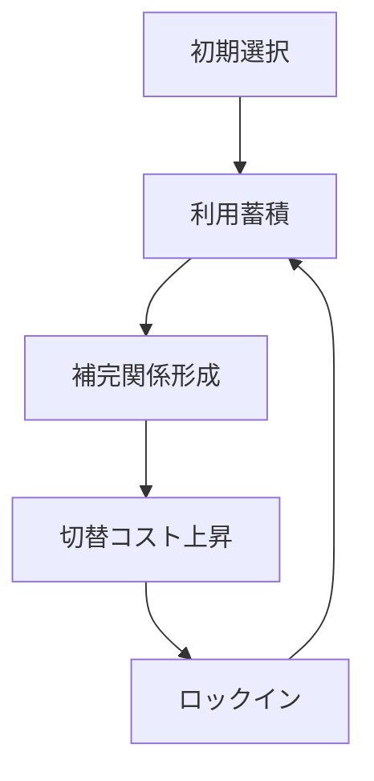
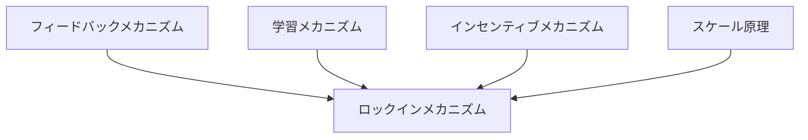

# ロックインメカニズム

## 定義

ある技術・制度・行動様式・選択肢が一度広く採用されることで、

- 切替コスト
- 学習蓄積
- 補完関係
- 規格統一
- 慣性

が生じ、**より良い代替案があっても既存の選択が維持され続ける仕組み**を  
**ロックインメカニズム** という。

---

# 基本構造



つまり

```text
初期選択
↓
蓄積
↓
補完関係
↓
切替困難
↓
固定化
```

という循環である。

---

# ロックインの本質

## 1 過去の選択が未来を縛る

ロックインでは

```text
今の最適
```

ではなく

```text
過去に選ばれたもの
```

が強く残る。

---

## 2 優れた代替案があっても変わらない

ロックインは

- 非効率
- 旧式
- 不便

であっても起こる。

重要なのは性能より

```text
切替困難性
```

である。

---

## 3 個別合理性が全体固定を生む

一人ひとりにとっては現状維持が合理的でも、  
全体としては非効率な固定化になることがある。

---

# ロックインが起こる条件

## 1 初期優位

最初に採用されたこと自体が優位になる。

---

## 2 学習効果

使い続けるほど

- 慣れる
- ノウハウが溜まる
- 教育コストが下がる

---

## 3 補完財・周辺制度

既存選択に合わせて周辺が整備される。

例

- 規格
- 部品
- 法制度
- 人材育成

---

## 4 切替コスト

変えるには

- 金
- 時間
- 混乱
- 再学習

が必要になる。

---

## 5 ネットワーク効果

多くの人が使うほど使う価値が増える。

---

# kernelとの関係



---

# フィードバックとの関係

ロックインはしばしば

```text
使われる
↓
さらに使いやすくなる
↓
さらに使われる
```

という正のフィードバックで進む。

---

# 学習との関係

人や組織が既存方式に習熟すると、  
新方式への切替が不利になる。

学習の蓄積はロックインを強化する。

---

# インセンティブとの関係

個々の主体にとっては

```text
今変えない方が得
```

というインセンティブが働く。

そのため全体最適より現状維持が選ばれる。

---

# スケール原理との関係

規模が大きいほど

- 切替対象が多い
- 利害関係者が多い
- 混乱コストが高い

ためロックインは強くなる。

---

# ロックインの類型

## 技術ロックイン

特定技術や規格が固定化する。

例  
古いフォーマット、レガシーシステム。

---

## 制度ロックイン

制度や慣行が変えにくくなる。

例  
既得権益、古い行政手続。

---

## 行動ロックイン

個人や組織の習慣が固定化する。

例  
旧来の働き方、慣習的意思決定。

---

## 市場ロックイン

市場で既存プレイヤーや規格が固定化する。

例  
プラットフォーム支配、互換性支配。

---

# ロックインの効果

## 正の面

- 安定性
- 予測可能性
- 取引コスト低下
- 学習効率

---

## 負の面

- 非効率固定
- 技術停滞
- 改革困難
- 新規参入阻害

---

# ロックインからの脱出条件

## 外部ショック

危機や大失敗で現状維持が不可能になる。

---

## 切替コスト低下

移行支援や標準化によって変えやすくする。

---

## 補完環境の再構築

新制度や新規格に合わせて周辺を整える。

---

## 強制的制度変更

法律・権限・経営判断で変える。

---

# 各領域での例

## 技術

- レガシーシステム
- 古い規格
- 古いUI慣習

---

## 組織

- 稟議文化
- 紙運用
- 旧式の評価制度

---

## 市場

- 既存プラットフォーム依存
- 規格争いの勝者固定

---

## 社会・制度

- 行政手続の旧来方式
- 既得権構造
- 旧制度の温存

---

# pattern

ロックインメカニズムから現れやすいパターン

- 経路依存
- レガシー固定
- 既得権維持
- 制度硬直
- 標準固定化

---

# case

- QWERTY配列
- レガシー基幹システム
- 紙ベース行政手続
- プラットフォーム依存
- 古い業界慣行の維持

---

# 見分けるための問い

- なぜ今もそれが使われ続けているのか
- 性能以外に何が切替を妨げているのか
- 学習蓄積や補完環境はあるか
- 個別合理性が全体固定を生んでいないか
- 何が起きればロックインを破れるか

---

# 要約

ロックインメカニズムとは

**初期選択に学習・補完関係・切替コストが積み重なり、より良い代替案があっても既存の選択が固定化される仕組み**

であり、

```text
初期選択
↓
蓄積
↓
補完関係
↓
切替困難
↓
固定化
```

という過程を通じて  
技術・制度・市場・組織の慣性と硬直を生み出す。