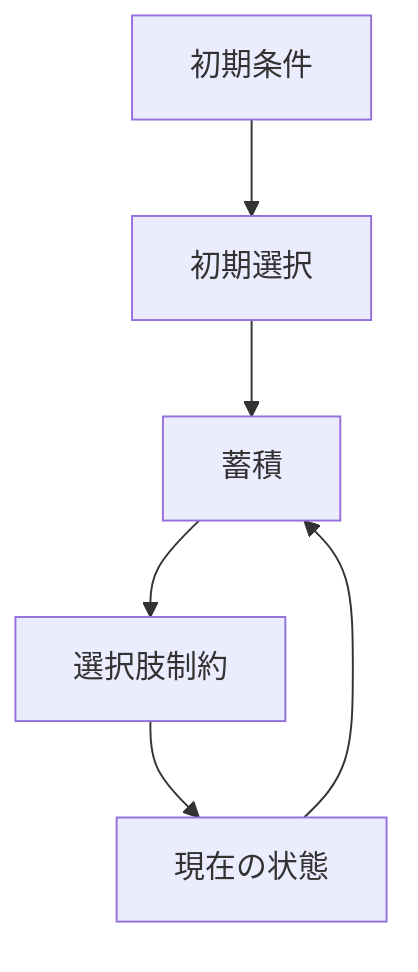
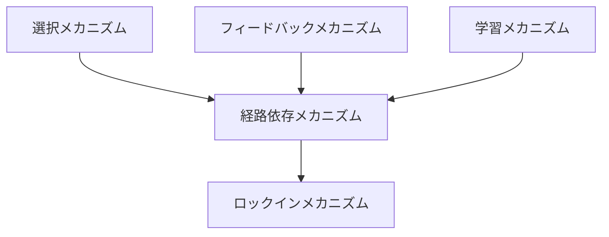

# 経路依存メカニズム

## 定義

過去の選択・出来事・初期条件が積み重なることで、  
現在および将来の選択肢や結果が強く制約される仕組みを  

**経路依存メカニズム（Path Dependence Mechanism）**という。

---

# 基本構造



つまり

```text
初期条件
↓
初期選択
↓
蓄積
↓
選択肢制約
↓
現在
```

という履歴依存構造である。

---

# 経路依存の本質

## 1 「今」は過去の積み重ね

現在の状態は

```text
過去の連続的選択
```

の結果であり、単発の最適化では説明できない。

---

## 2 初期の小さな差が拡大する

初期の偶然や小差が

- 蓄積
- フィードバック
- 学習

を通じて拡大し、大きな差になる。

---

## 3 選択肢が狭まる

時間が経つほど

```text
できることが減る
```

方向に進む。

---

## 4 不可逆性

ある段階を超えると

```text
元に戻せない
```

状態になる。

---

# 経路依存が生まれる条件

## 1 初期条件の差

わずかな違いでも影響が蓄積される。

---

## 2 累積効果

過去の選択が次の選択を左右する。

---

## 3 正のフィードバック

成功や採用がさらなる採用を呼ぶ。

---

## 4 切替コスト

途中から別の経路に移るのが難しい。

---

## 5 学習・制度の蓄積

既存のやり方に最適化される。

---

# kernelとの関係



---

# 選択との関係

選択は単発ではなく、

```text
連続した選択の履歴
```

として積み重なる。

---

# フィードバックとの関係

正のフィードバックにより

```text
ある経路が強化される
```

---

# 学習との関係

過去の経験が

```text
未来の選択を偏らせる
```

---

# ロックインとの関係

経路依存が進行すると

```text
ロックイン
```

に至る。

---

# 経路依存のタイプ

## 技術経路依存

特定技術への依存。

---

## 制度経路依存

制度やルールが過去の延長で固定される。

---

## 行動経路依存

習慣や意思決定パターンが固定される。

---

## 市場経路依存

特定企業・規格が優位を維持する。

---

# 経路依存の効果

## 正の面

- 安定性
- 予測可能性
- 学習効率
- 制度継続性

---

## 負の面

- 非効率固定
- 技術停滞
- 柔軟性低下
- 改革困難

---

# 経路依存の段階


---

# 各領域での例

## 技術

- キーボード配列
- OSや規格

---

## 組織

- 業務プロセス
- 意思決定文化

---

## 市場

- プラットフォーム支配
- 規格競争の勝者

---

## 社会・制度

- 法制度
- 行政手続
- 教育制度

---

# pattern

経路依存メカニズムから現れるパターン

- 初期優位固定
- 偶然の制度化
- レガシー継続
- 分岐固定
- ロックイン

---

# case

- QWERTY配列
- VHS vs Betamax
- レガシーシステム
- 行政制度の継続
- 企業文化の固定

---

# 見分けるための問い

- 現在の状態はどの過去選択の結果か
- 初期条件は何だったか
- なぜ別の選択がされなかったか
- 切替コストは何か
- どの時点で不可逆になったか

---

# 要約

経路依存メカニズムとは

**過去の選択と初期条件が積み重なり、現在および将来の選択肢や結果を強く制約する仕組み**

であり、

```text
初期条件
↓
初期選択
↓
蓄積
↓
選択肢制約
↓
現在
```

という構造を通じて  
制度・技術・市場・行動の長期的な固定と分岐を生み出す。